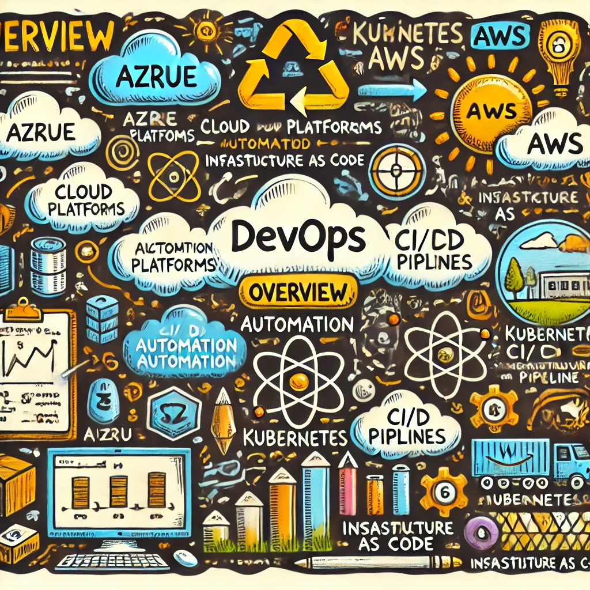

# Phuong Vo's DevOps Journey

Welcome to Phuong Vo's DevOps journey! Here, I share my experiences, insights, and knowledge about DevOps and Cloud computing. Whether you're a beginner or a seasoned professional, I hope you'll find something useful and interesting.

In this site, you will find:
- **Real-world case studies** showcasing DevOps projects.
- **Tool reviews** and comparisons to help you choose the best stack.
- **Step-by-step tutorials** to build your skills in cloud computing, automation, and more.
- **Career advice** for those looking to break into the field or take their skills to the next level.
- **Interviews with industry experts**, providing insights from professionals.
- **My personal reflections** on the evolving field of DevOps.
- **DevOps for Beginners** A curriculum to learn and hands-on practice

## Navigation
- [Home](https://phuongvo9.github.io)
- [About](#introduction)
- [Contact](#contact)
- [Blog Categories](#categories)
- [Support Me on BuyMeACoffee](https://buymeacoffee.com/phuongvo)

---

## Featured Posts
Here are some of the must-read posts to get started:
- [DevOps for Beginners: A Curriculum](#devops-for-beginners---a-curriculum)

---

## Categories

### Tutorials and How-Tos
Step-by-step guides to mastering essential DevOps skills.
- **[DevOps for Beginners: A Curriculum](#devops-for-beginners---a-curriculum)**  
  A structured learning path for newcomers in DevOps, covering topics like automation, cloud services, and CI/CD pipelines.

---

### Career Advice
Tips and personal experiences on growing your DevOps career.
- **[Career Tip: Building Your DevOps Portfolio](/blogs/career-tip/building-your-devops-porfolio.md)**  
    Breaking into the DevOps field can be challenging, but with the right approach, you can build a strong portfolio that will help you land internships, fresher positions, and eventually, more advanced roles. This guide will walk you through the steps to create a compelling DevOps portfolio and provide tips for your career progression.  

- **[Advice: Certifications That Matter](/blogs/career-advice/certification-in-devops-matter-or-not.md)**  
  A breakdown of the certifications that can boost your career in DevOps.

---

### Personal Reflections
Thoughts and reflections on my own DevOps journey.
- **[Reflection: What I’ve Learned from Failure](#personal-reflections)**  
  A personal story of a failed deployment and the lessons learned from it.

- **[Reflection: The Importance of Continuous Learning in DevOps](#personal-reflections)**  
  Why staying on top of new tools and technologies is crucial in the fast-evolving field of DevOps.

---

### Book and Course Reviews
Reviews of the best resources to help you upskill.
- **[Book Review: The Phoenix Project](#book-and-course-reviews)**  
  A review of this essential DevOps novel and why every DevOps engineer should read it.
  
- **[Course Review: Azure DevOps expert](#book-and-course-reviews)**  
  A detailed review of the Azure DevOps expert certification course, including study tips and exam strategies.

---

### Community Involvement
Sharing events and activities I've participated in within the DevOps community.
- **[Event: DevOpsCon 2024](#community-involvement)**  
  A summary of my experience attending DevOpsCon, including key takeaways from the talks and workshops.
  
- **[Event: Kubernetes Meetup](#community-involvement)**  
  Insights from a Kubernetes meetup in my local tech community.

---

### Problem-Solving Stories
Troubleshooting and problem-solving stories in live production or preprod environments.
- **[Understand Let's encrypt DNS SERVFAIL error](/blogs/problem-solving/2024-10-18-fix-dns-error-servfail-txt-acme-challenge.md)**  
  If you're using Let's encrypt and have error on SERVFAIL DNS-01 authentication problem
- **[Fixing 404 Errors on a Docsify Site Hosted on GitHub Pages](./blogs/problem-solving/2024-10-15-fix-404-error-docsify-github-pages.md)**  
  If you're using Docsify to host your static website on GitHub Pages, you might have encountered a frustrating issue: navigating directly to a specific page results in a "404 Page Not Found" error. This guide helps you resolve it

### Project Case Studies
Deep dives into real-world projects I've worked on, with a focus on practical challenges and solutions.

- **[Building a Scalable and Secure Media Management Solution on Azure Kubernetes Service](blogs/project-case/building-a-scalable-secure-media-management-solution-aks)**  

- **[Implementing GitOps with FluxCD on Azure Kubernetes Service (AKS)](#project-case-studies)**  
  This case study explores how we leveraged FluxCD to implement GitOps on Azure Kubernetes Service (AKS). It covers the setup process, challenges faced, and the benefits of using GitOps for continuous deployment

- **[Scaling Applications with Azure Kubernetes Service and GitOps](#project-case-studies)** 
  This case study focuses on how we used Azure Kubernetes Service (AKS) and GitOps to scale applications efficiently. It discusses the architecture, deployment strategies, and the impact on application performance and reliability.

- **[Optimizing Resource Management with Infrastructure as Code on Azure](#project-case-studies)** 
  This project highlights how we optimized resource management on Azure using Infrastructure as Code (IaC) tools like ARM templates and Terraform. It discusses the strategies for resource allocation, cost management, and the overall impact on operational efficiency.

- **[Deploying Microservices on Azure Kubernetes Service with GitOps](#project-case-studies)** 
  This case study provides a detailed guide on deploying microservices on Azure Kubernetes Service (AKS) using GitOps. It covers the architecture, deployment process, and the benefits of using GitOps for managing microservices.

- **[Troubleshooting APNs Push Notification Issue for Live Activities in iOS](blogs/project-case/Troubleshooting-APNs-Push-Notification-Issue-for-Live-Activities-in-iOS)** 

---

### Tool Reviews and Comparisons
Unbiased reviews of popular DevOps tools, and my experiences working with them.
- **[GitOps: ArgoCD vs FluxCD](#gitops-argocd-and-fluxcd)**  
  An in-depth comparison of two GitOps solutions—when to use each, their strengths, and weaknesses.

---

### Industry Trends and News
Keep up with the latest developments in DevOps and cloud technologies.
- **[Trend Analysis: The Rise of GitOps](#industry-trends-and-news)**  
  Why GitOps is rapidly becoming the preferred approach to managing infrastructure, and where the trend is heading.

---

### Interviews with Experts
Conversations with experienced professionals from the DevOps world.
- **[Interview with Josef Po, .NET Developer to DevOps engineer](#interviews-with-experts)**  
  Insights from an DevOps expert in PPF
  
- **[Interview with Jakub H., Kubernetes Engineer](#interviews-with-experts)**  
  Lessons from a seasoned Kubernetes engineer on managing containerized applications at scale in PPF

---

## Contact
- LinkedIn: [Phuong.VoHuy](https://www.linkedin.com/in/phuongvohuy/)

---

# DevOps for Beginners - A Curriculum

||
|:---:|
| DevOps For Beginners - _Sketchnote Overview_ |

Explore the world of **DevOps** with the 12-week, 24-lesson curriculum! It includes practical lessons, quizzes, and labs. The curriculum is beginner-friendly and covers tools like Kubernetes, Terraform, Azure, and AWS, as well as DevOps best practices and automation.

## What you will learn

**[Mindmap of the Course](./assets/mindmap-devops.html)**

In this curriculum, you will learn:

* **GitOps** principles and how to use **Git** as a single source of truth for Kubernetes environments.
* **Cloud Services** like **AWS** and **Azure**, and how to manage infrastructure across multiple cloud platforms.
* **Container Orchestration** with **Kubernetes** to automate deployment, scaling, and management of applications.
* **Infrastructure as Code (IaC)** tools such as **Terraform** and **ARM templates** for automating infrastructure deployment.
* **CI/CD** (Continuous Integration/Continuous Delivery) with **Azure Pipelines** and **Azure DevOps**.
* Shell scripting and automation using **Bash** and **Linux**.
* **Python** for automating repetitive DevOps tasks and writing infrastructure tests.

What we will not cover in this curriculum:

> [Find all additional resources for this course in our recommended collection](https://github.com/phuongvo9/DevOps-Essentials)

* **Advanced Security Practices**. Consider taking dedicated courses on **DevSecOps** for comprehensive security practices in DevOps.
* **Cloud Cost Management** techniques. This topic is well covered in specialized resources for optimizing cloud expenditures.
* **Legacy Systems Integration** with DevOps tools.
* **Deep Monitoring and Observability** beyond the basics taught here.

## Content
| No. |                                                                 Lesson Link                                                                  |                                           Tools & Frameworks                                          | Lab                                                            |
| :-: | :------------------------------------------------------------------------------------------------------------------------------------------: | :---------------------------------------------------------------------------------------------: | ------------------------------------------------------------------------------ |
| 0  |                                 [Course Setup](./blogs/0-course-setup.md)                                 |                      [Setup Your Development Environment](./blogs/0-environment-setup.md)                       |   |
| I  |               [**Getting started with the basics**](./blogs/1-getting-started-basics.md)      | | |
| 1  |       [Introduction and History of DevOps](./blogs/1-introduction-history.md)       |           -                            | -  |
| 2  |       [What is DevOps](./blogs/1-introduction-history.md)       |           -                            | -  |
| 3  |       [People in DevOps](./blogs/3-people-in-devops.md)       |           -                            | -  |
| 4  |       [Assses your software developement process](./blogs/4-assess-software-development-process.md)       |           -                            | -  |
| 5  |       [Product and Technology in DevOps](./blogs/5-product-technology.md)       |           -                            | -  |
| 6  |       [Linux Fundamentals](./blogs/6-linux-fundamentals.md)       |           -                            | -  |
| 7  |       [Network Fundamentals](./blogs/7-network-fundamentals.md)       |           -                            | -  |
| 8  |       [Applications Fundamentals](./blogs/8-applications-fundamentals.md)       |           -                            | -  |
| 9  |       [Git fundamentals](./blogs/9-git-fundamentals.md)       |           -                            | -  |
| 10  |       [Database Fundamentals](./blogs/10-database-fundamentals.md)       |           -                            | -  |
| 11  |       [Security Fundamentals](./blogs/11-security-fundamentals.md)       |           -                            | -  |
| 12  |       [2 Tier applications](./blogs/12-2-tier-applications.md)       |           -                            | -  |
| II |              **Linux**              |
| 13  |       [Introduction to Linux](./blogs/13-introduction-linux.md)       |           -                            | -  |
| 14  |       [Working with shell 1](./blogs/14-working-with-shell-1.md)       |           -                            | -  |
| 15  |       [Linux core concepts](./blogs/15-linux-core-concepts.md)       |           -                            | -  |
| 16  |       [Package management](./blogs/16-package-management.md)       |           -                            | -  |
| 17  |       [Working with shell 2](./blogs/17-working-with-shell-2.md)       |           -                            | -  |
| 18  |       [Networking](./blogs/18-networking.md)       |           -                            | -  |
| 19  |       [Security and Permissions](./blogs/19-security-permissions.md)       |           -                            | -  |
| 20  |       [Service management with SYSTEMD](./blogs/20-service-management-systemd.md)       |           -                            | -  |
| 21  |       [Storage in Linux](./blogs/21-storage-in-linux.md)       |           -                            | -  |
| III |              **Shell scripting**              |
| 22  |       [Shell condition](./blogs/22-shell-condition.md)       |           -                            | -  |
| 23  |       [Shell flow control](./blogs/23-shell-flow-control.md)       |           -                            | -  |
| 24  |       [Shell scripting project](./blogs/24-shell-scripting-project.md)       |           -                            | -  |
| IV |            **CI/CD Pipelines**             | [Azure DevOps](./blogs/azure-devops.md) | [Create a Pipeline](./blogs/create-pipeline.md)|
| 25  |            [Introduction to CI/CD](./blogs/25-introduction-cicd.md)             |           [Azure Pipelines](./blogs/azure-pipelines.md)             | [Lab](./blogs/25-cicd-lab.md) |
| V |              **Docker Container**              |
| VI |              **Kubernetes Basics**              | [Kubernetes Setup Guide](./blogs/kubernetes-setup-guide.md)| [Explore Kubernetes](./blogs/explore-kubernetes.md) |
| 26  |            [Understanding Pods, Nodes, and Services](./blogs/26-pods-nodes-services.md)             |           [Kubernetes Commands](./blogs/kubernetes-commands.md)         | [Lab](./blogs/26-kubernetes-lab.md) |
| 27  |            [Kubernetes Deployment Strategies](./blogs/27-deployment-strategies.md)             |           [Blue-Green Deployment](./blogs/blue-green-deployment.md) / [Canary Release](./blogs/canary-release.md)             | [Lab](./blogs/27-kubernetes-lab.md) |
| VII |       [**Cloud Platforms Overview**](./blogs/cloud-platforms-overview.md) |||
| 28  |                [Introduction to AWS and Azure](./blogs/28-aws-azure.md)                 |                       [AWS Setup Guide](./blogs/aws-setup-guide.md) / [Azure Basics](./blogs/azure-setup-guide.md)                      | [Lab](./blogs/28-cloud-lab.md) |
| 29  |                   [Multi-Cloud Environments](./blogs/29-multi-cloud-environments.md)                   |        [Multi-Cloud Strategies](./blogs/multi-cloud-strategies.md)        | [Lab](./blogs/29-cloud-lab.md) |
| 30  |            [Infrastructure as Code with Terraform](./blogs/30-infrastructure-as-code-terraform.md)             |           [Terraform Basics](./blogs/terraform-basics.md) / [AWS IaC](./blogs/aws-iac.md)             | [Lab](./blogs/30-terraform-lab.md) |
| VIII |              **GitOps**              |
| 31  |       [GitOps and Version Control](./blogs/31-gitops-version-control.md)       |            [Git Basics](./blogs/git-basics.md) /  [GitOps with Kubernetes](./blogs/gitops-kubernetes.md)                             |  |
| IX |            [**Automation with Scripting**](./blogs/automation-with-scripting.md)             | [Bash Scripting](./blogs/bash-scripting.md) | [Automate with Bash](./blogs/automate-with-bash.md) |
| 32  |            [Advanced Bash Techniques](./blogs/32-advanced-bash.md)             |           [Loops and Conditionals](./blogs/bash-loops-conditionals.md)             | [Lab](./blogs/32-advanced-bash-lab.md) |
| X |              **Programming with Golang**              |
| 33  |       [Basic Go](./blogs/33-basic-go.md)       |           -                            | -  |
| XI |            **Python for DevOps**             |||
| 34  |            [Introduction to Python for DevOps](./blogs/34-python-for-devops.md)             |           [Automating with Python](./blogs/automate-python.md)             | [Lab](./blogs/34-python-lab.md) |
| XII  |            **Use case** | | |
| 35  |            [DevOps Best Practices](./blogs/35-devops-best-practices.md)             |           [Documentation and Testing](./blogs/documentation-testing.md)    | |

## Each lesson contains

* Pre-reading material
* Practical labs to apply the material you have learned.
* Quizzes to test your knowledge and understanding.

## Getting Started

- We have created a [setup lesson](./lessons/0-course-setup/setup.md) to help you with setting up your development environment.
- How to [Run the code in a VSCode or Codepace](./lessons/0-course-setup/how-to-run.md).

Don't forget to star (🌟) this repo to find it easier later.

## Quizzes

> **A note about quizzes**: All quizzes are contained in the Quiz-app folder in etc\quiz-app. They are linked from within the lessons. The quiz app can be run locally or deployed to Azure; follow the instructions in the `quiz-app` folder.

## Help Wanted

Do you have suggestions or found spelling or code errors? Raise an issue or create a pull request.

## Special Thanks
* **🙏 Core Contributors:** [Contributors](https://github.com/phuongvo9/phuongvo9.github.io/graphs/contributors)

## Inspired by Curricula from Microsoft Learn

*Special thanks to Microsoft Learn for their inspiring curricula. Their comprehensive and beginner-friendly courses have motivated me to create this DevOps curriculum to help others embark on their DevOps journey.*

* [Machine Learning for Beginners](https://aka.ms/ml4beginners)
* [Generative AI for Beginners](https://aka.ms/genai-beginners)
* [Web Dev for Beginners](https://aka.ms/webdev-beginners)
* [Cybersecurity for Beginners](https://aka.ms/security-101)
* [ML for Beginners](https://aka.ms/ml-beginners)
* [Data Science for Beginners](https://aka.ms/datascience-beginners)
* [AI for Beginners](https://aka.ms/ai-beginners)
* [Cybersecurity for Beginners](https://github.com/microsoft/Security-101)
* [IoT for Beginners](https://aka.ms/iot-beginners)
* [XR Development for Beginners](https://github.com/microsoft/xr-development-for-beginners)
* [Mastering GitHub Copilot for AI Paired Programming](https://aka.ms/GitHubCopilotAI)

===

TODO:

1. Add Personal reflection
2. Book and Course Reviews
3. Community involvment
4. Industry trends and news
5. Interview with Experts