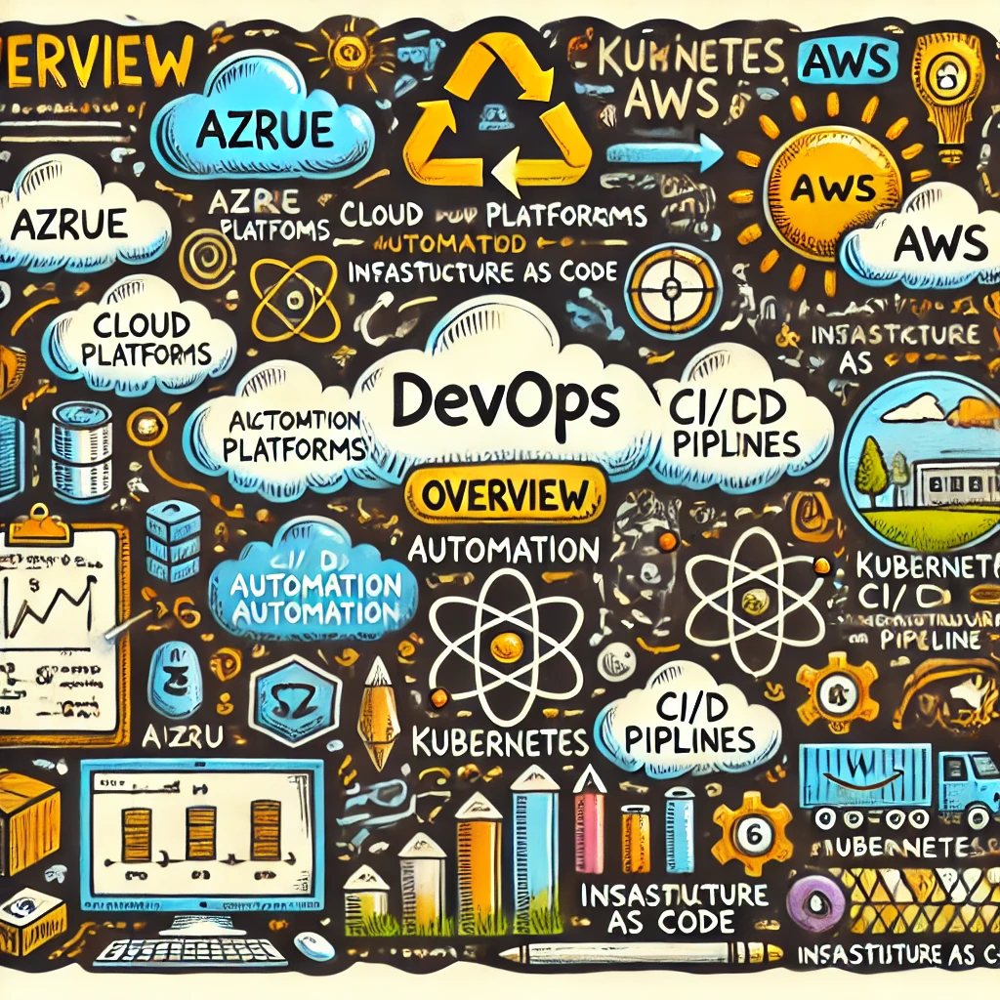

# DevOps for Beginners - A Curriculum

||
|:---:|
| DevOps For Beginners - _Sketchnote Overview_ |

Explore the world of **DevOps** with the 12-week, 24-lesson curriculum! It includes practical lessons, quizzes, and labs. The curriculum is beginner-friendly and covers tools like Kubernetes, Terraform, Azure, and AWS, as well as DevOps best practices and automation.

## What you will learn

**[Mindmap of the Course](./assets/mindmap-devops.html)**

In this curriculum, you will learn:

* **GitOps** principles and how to use **Git** as a single source of truth for Kubernetes environments.
* **Cloud Services** like **AWS** and **Azure**, and how to manage infrastructure across multiple cloud platforms.
* **Container Orchestration** with **Kubernetes** to automate deployment, scaling, and management of applications.
* **Infrastructure as Code (IaC)** tools such as **Terraform** and **ARM templates** for automating infrastructure deployment.
* **CI/CD** (Continuous Integration/Continuous Delivery) with **Azure Pipelines** and **Azure DevOps**.
* Shell scripting and automation using **Bash** and **Linux**.
* **Python** for automating repetitive DevOps tasks and writing infrastructure tests.

What we will not cover in this curriculum:

> [Find all additional resources for this course in our recommended collection](https://github.com/phuongvo9/DevOps-Essentials)

* **Advanced Security Practices**. Consider taking dedicated courses on **DevSecOps** for comprehensive security practices in DevOps.
* **Cloud Cost Management** techniques. This topic is well covered in specialized resources for optimizing cloud expenditures.
* **Legacy Systems Integration** with DevOps tools.
* **Deep Monitoring and Observability** beyond the basics taught here.

## Content
|     |                                                                 Lesson Link                                                                  |                                           Tools & Frameworks                                          | Lab                                                            |
| :-: | :------------------------------------------------------------------------------------------------------------------------------------------: | :---------------------------------------------------------------------------------------------: | ------------------------------------------------------------------------------ |
| 0  |                                 [Course Setup](./lessons/0-course-setup/setup.md)                                 |                      [Setup Your Development Environment](./lessons/0-course-setup/how-to-run.md)                       |   |
| I  |               [**Getting started with the basics**](./lessons/1-Intro/README.md)      | | |
| 1  |       [Introduction and History of DevOps](./lessons/1-Intro/README.md)       |           -                            | -  |
| 2  |       [What is DevOps](./lessons/1-Intro/README.md)       |           -                            | -  |
| 3  |       [People in DevOps](./lessons/1-Intro/README.md)       |           -                            | -  |
| 4  |       [Process in DevOps](./lessons/1-Intro/README.md)       |           -                            | -  |
| 5  |       [Product and Technology in DevOps](./lessons/1-Intro/README.md)       |           -                            | -  |
| 6  |       [Linux Fundamentals](./lessons/1-Intro/README.md)       |           -                            | -  |
| 7  |       [Network Fundamentals](./lessons/1-Intro/README.md)       |           -                            | -  |
| 8  |       [Applications Fundamentals](./lessons/1-Intro/README.md)       |           -                            | -  |
| 9  |       [Git fundamentals](./lessons/1-Intro/README.md)       |           -                            | -  |
| 10  |       [Database Fundamentals](./lessons/1-Intro/README.md)       |           -                            | -  |
| 11  |       [Security Fundamentals](./lessons/1-Intro/README.md)       |           -                            | -  |
| 12  |       [2 Tier applications](./lessons/1-Intro/README.md)       |           -                            | -  |
| II |              **Linux**              |
| 13  |       [Introduction to Linux](./lessons/1-Intro/README.md)       |           -                            | -  |
| 14  |       [Working with shell 1](./lessons/1-Intro/README.md)       |           -                            | -  |
| 15  |       [Linux core concepts](./lessons/1-Intro/README.md)       |           -                            | -  |
| 16  |       [Package management](./lessons/1-Intro/README.md)       |           -                            | -  |
| 17  |       [Working with shell 2](./lessons/1-Intro/README.md)       |           -                            | -  |
| 18  |       [Networking](./lessons/1-Intro/README.md)       |           -                            | -  |
| 19  |       [Security and Permissions](./lessons/1-Intro/README.md)       |           -                            | -  |
| 20  |       [Service management with SYSTEMD](./lessons/1-Intro/README.md)       |           -                            | -  |
| 21  |       [Storage in Linux](./lessons/1-Intro/README.md)       |           -                            | -  |
| III |              **Shell scripting**              |
| 22  |       [Shell condition](./lessons/1-Intro/README.md)       |           -                            | -  |
| 23  |       [Shell flow control](./lessons/1-Intro/README.md)       |           -                            | -  |
| 24  |       [Shell scripting project](./lessons/1-Intro/README.md)       |           -                            | -  |
| IV |            **CI/CD Pipelines**             | [Azure DevOps](./lessons/6-CICD/AzureDevOps.md) | [Create a Pipeline](./lessons/6-CICD/CreatePipeline.md)|
| 25  |            [Introduction to CI/CD](./lessons/6-CICD/08-CICD/README.md)             |           [Azure Pipelines](./lessons/6-CICD/AzurePipelines.md)             | [Lab](./lessons/6-CICD/08-CICD/lab/README.md) |
| V |              **Docker Container**              |
| VI |              **Kubernetes Basics**              | [Kubernetes Setup Guide](./lessons/5-Kubernetes/SetupGuide.md)| [Explore Kubernetes](./lessons/5-Kubernetes/Explore.md) |
| 26  |            [Understanding Pods, Nodes, and Services](./lessons/5-Kubernetes/06-Basics/README.md)             |           [Kubernetes Commands](./lessons/5-Kubernetes/Commands.md)         | [Lab](./lessons/5-Kubernetes/06-Basics/lab/README.md) |
| 27  |            [Kubernetes Deployment Strategies](./lessons/5-Kubernetes/07-Deployment/README.md)             |           [Blue-Green Deployment](./lessons/5-Kubernetes/BlueGreen.md) / [Canary Release](./lessons/5-Kubernetes/CanaryRelease.md)             | [Lab](./lessons/5-Kubernetes/07-Deployment/lab/README.md) |
| VII |       [**Cloud Platforms Overview**](./lessons/3-Cloud/README.md) |||
| 28  |                [Introduction to AWS and Azure](./lessons/3-Cloud/03-AWS-Azure/README.md)                 |                       [AWS Setup Guide](./lessons/3-Cloud/03-AWS-Azure/AWSSetup.md) / [Azure Basics](./lessons/3-Cloud/03-AWS-Azure/AzureSetup.md)                      | [Lab](./lessons/3-Cloud/03-AWS-Azure/lab/README.md) |
| 29  |                   [Multi-Cloud Environments](./lessons/3-Cloud/04-MultiCloud/README.md)                   |        [Multi-Cloud Strategies](./lessons/3-Cloud/04-MultiCloud/Strategies.md)        | [Lab](./lessons/3-Cloud/04-MultiCloud/lab/README.md) |
| 30  |            [Infrastructure as Code with Terraform](./lessons/4-IaC/README.md)             |           [Terraform Basics](./lessons/4-IaC/TerraformBasics.md) / [AWS IaC](./lessons/4-IaC/AWSIaC.md)             | [Lab](./lessons/4-IaC/lab/README.md) |
| VIII |              **GitOps**              |
| 31  |       [GitOps and Version Control](./lessons/2-GitOps/README.md)       |            [Git Basics](./lessons/2-GitOps/GitBasics.md) /  [GitOps with Kubernetes](./lessons/2-GitOps/KubernetesGitOps.md)                             |  |
| IX |            [**Automation with Scripting**](./lessons/7-Automation/README.md)             | [Bash Scripting](./lessons/7-Automation/Bash.md) | [Automate with Bash](./lessons/7-Automation/Automate.md) |
| 32  |            [Advanced Bash Techniques](./lessons/7-Automation/09-AdvancedBash/README.md)             |           [Loops and Conditionals](./lessons/7-Automation/AdvancedBash.md)             | [Lab](./lessons/7-Automation/09-AdvancedBash/lab/README.md) |
| X |              **Programming with Golang**              |
| 33  |       [Basic Go](./lessons/1-Intro/README.md)       |           -                            | -  |
| XI |            **Python for DevOps**             |||
| 34  |            [Introduction to Python for DevOps](./lessons/8-Python/README.md)             |           [Automating with Python](./lessons/8-Python/AutomatePython.md)             | [Lab](./lessons/8-Python/lab/README.md) |
| XII  |            **Use case** | | |
| 35  |            [DevOps Best Practices](./lessons/9-BestPractices/README.md)             |           [Documentation and Testing](./lessons/9-BestPractices/Documentation.md)    | |

## Each lesson contains

* Pre-reading material
* Practical labs to apply the material you have learned.
* Quizzes to test your knowledge and understanding.

## Getting Started

- We have created a [setup lesson](./lessons/0-course-setup/setup.md) to help you with setting up your development environment.
- How to [Run the code in a VSCode or Codepace](./lessons/0-course-setup/how-to-run.md).

Don't forget to star (🌟) this repo to find it easier later.

## Quizzes

> **A note about quizzes**: All quizzes are contained in the Quiz-app folder in etc\quiz-app. They are linked from within the lessons. The quiz app can be run locally or deployed to Azure; follow the instructions in the `quiz-app` folder.

## Help Wanted

Do you have suggestions or found spelling or code errors? Raise an issue or create a pull request.

## Special Thanks
* **🙏 Core Contributors:** [Contributors](https://github.com/phuongvo9)

## Inspired by Curricula from Microsoft Learn

*Special thanks to Microsoft Learn for their inspiring curricula. Their comprehensive and beginner-friendly courses have motivated me to create this DevOps curriculum to help others embark on their DevOps journey.*

* [Data Science for Beginners](https://aka.ms/ds4beginners)
* [Machine Learning for Beginners](https://aka.ms/ml4beginners)
* [Web Dev for Beginners](https://aka.ms/webdev-beginners)
* [Cybersecurity for Beginners](https://aka.ms/security-101)