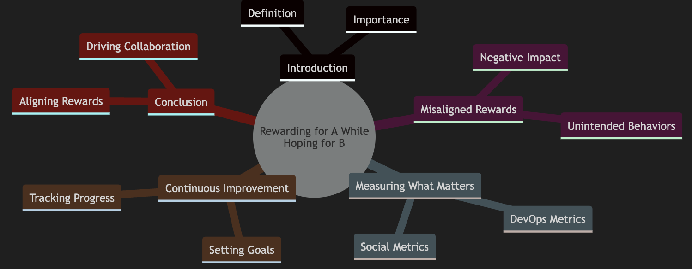
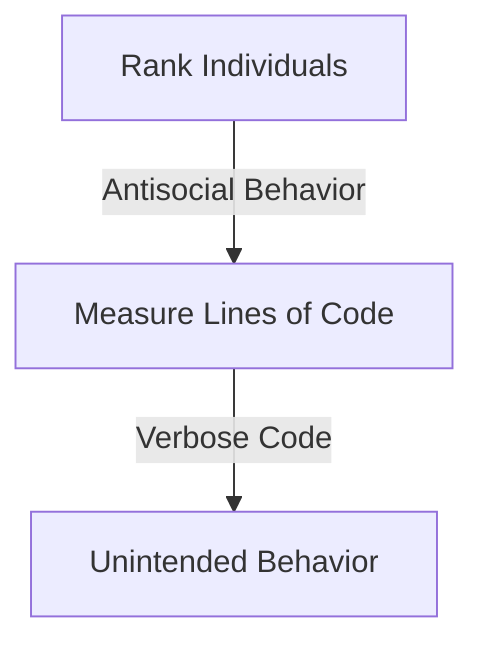
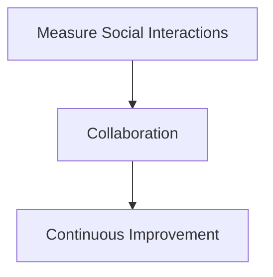
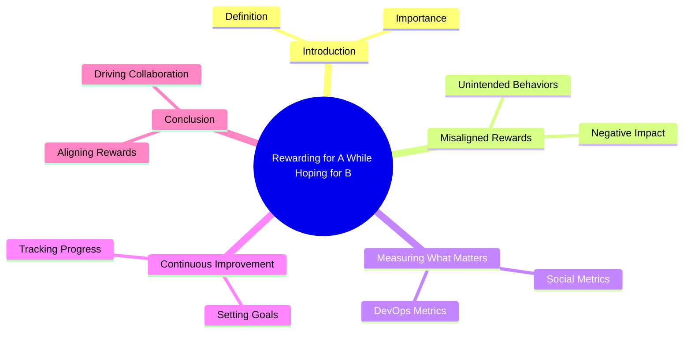

# Rewarding for A While Hoping for B

The concept of "rewarding for A while hoping for B" highlights the importance of aligning rewards with desired outcomes. In the context of DevOps, it emphasizes the need to measure and reward behaviors that drive continuous improvement and collaboration

## Key Concepts

### The Folly of Rewarding for A While Hoping for B
This concept, introduced by Steven Kerr in 1975, explains that organisms, including humans, seek to perform activities that are rewarded. If rewards are misaligned with desired outcomes, it leads to unintended behaviors

### Importance of Measuring What Matters
You cannot measure for A and hope to get B. It’s essential to measure what truly matters to achieve desired outcomes. For example, measuring lines of code can lead to verbose code, while measuring social interactions can foster collaboration

### Social and DevOps Metrics
To drive social behavior and continuous improvement in DevOps, it’s crucial to measure:
- **Code Reuse**: Who is leveraging the code you are building?
- **Code Leveraging**: Whose code are you leveraging?

### Continuous Improvement
DevOps is about continuous improvement. Establishing baselines and setting measurable goals helps track progress and drive improvements. By measuring what matters, organizations can foster collaboration and achieve better software delivery

## Diagram: Misconceptions vs. Correct Approach

### Misconceptions

### Correct Approach

## Summary
1. Aligning rewards with desired outcomes is crucial for fostering the right behaviors in a DevOps environment.
1. Please keep measuring what matters and focusing on continuous improvement, organizations can achieve better collaboration and higher-quality software delivery

## References
- Steven Kerr: "The folly of rewarding for A, while hoping for B"
- Jez Humble: "Measuring social metrics leads to improved socialization and measuring DevOps metrics allows you to see progression toward goals"

# Mindmap
