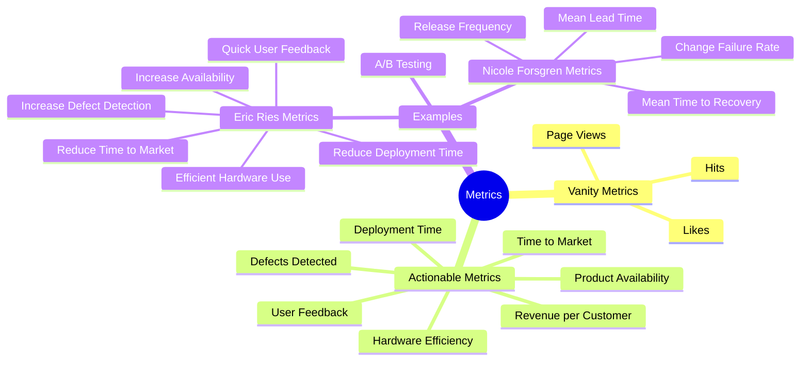

# Vanity Metrics vs. Actionable Metrics

This article provides an overview of the differences between vanity metrics and actionable metrics, including examples and explanations of each. Understanding these metrics is crucial for making informed decisions and driving meaningful improvements

## Overview

1. Vanity metrics are superficial measures that may look impressive but do not provide actionable insights
2. In contrast, actionable metrics offer valuable information that can guide decision-making and lead to tangible improvements


## Vanity Metrics

Vanity metrics are often used to make things look good on the surface but do not provide meaningful insights for decision-making. Examples include:

- Number of website hits
- Social media likes
- Page views

### Example: Website Hits

```plaintext
"We got 10,000 hits to our website!"
```

- What does a hit mean?
- Did one person click 10,000 times?
- Did 10,000 people click once and leave?

These questions highlight the limitations of vanity metrics. They indicate activity but do not provide actionable insights

## Actionable Metrics

Actionable metrics provide meaningful data that can guide decision-making and lead to improvements. Examples include:

- Revenue per customer
- Time to market for new features
- Overall product availability
- Time to deploy a software release
- Percentage of defects detected in testing
- Efficient use of hardware infrastructure
- Performance and user feedback

### Example: A/B Testing

Imagine you add a new feature to your website and use A/B split testing:

- Group A (50% of customers) does not see the new feature.
- Group B (50% of customers) sees the new feature.

After a few days, you compare the revenue from each group and find that Group B has 20% higher revenue per customer. This actionable metric provides a clear cause and effect, allowing you to make informed decisions.

## Actionable Metrics from Eric Ries

Eric Ries, author of "The Lean Startup," provides several examples of actionable metrics:

- Reduce time to market for new features
- Increase overall availability of the product
- Reduce the time it takes to deploy a software release
- Increase the percentage of defects detected in testing before production
- Make more efficient use of hardware infrastructure
- Provide performance and user feedback to the product manager quickly

## Actionable Metrics from Nicole Forsgren

Nicole Forsgren, in her 2017 talk "Tools Won’t Fix Your Broken DevOps," identified the top four actionable metrics:

1. **Mean Lead Time**: How long does it take for an idea to get to production?
2. **Release Frequency**: How quickly can you release things?
3. **Change Failure Rate**: How often do changes fail when deployed?
4. **Mean Time to Recovery**: How long does it take to recover from a failure?

## Diagram: Vanity Metrics vs. Actionable Metrics



## In short

1. Vanity metrics may look impressive but do not provide actionable insights
1. Actionable metrics, on the other hand, offer valuable information that can guide decision-making and lead to meaningful improvements. Focus on actionable metrics to drive success and achieve your goals