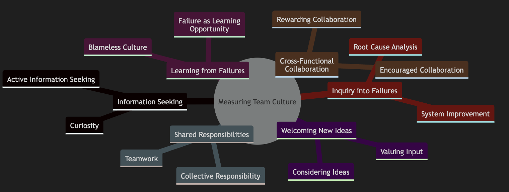
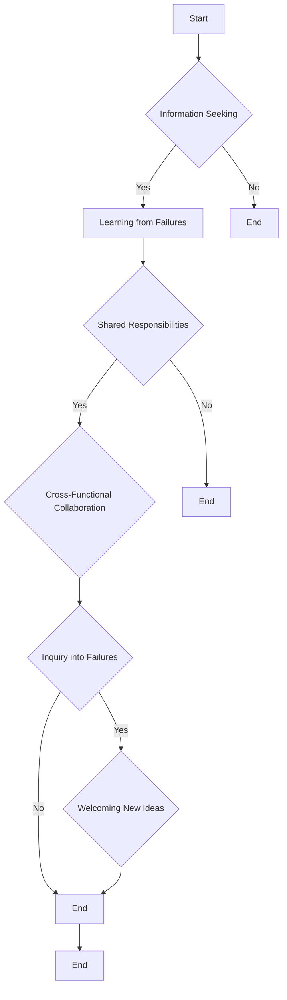
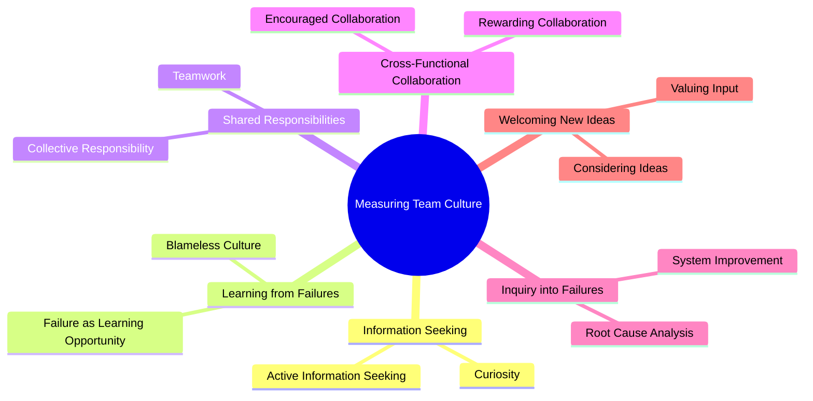

# How to Measure Your Culture

1. This article provides insights on how to measure your team's culture using a set of statements developed by Dr. Nicole Forsgren, former CEO and Chief Scientist at DevOps Research and Assessment (DORA)
2. These statements help in evaluating various aspects of team culture on a scale from 1 (strongly disagree) to 7 (strongly agree)

## Key Statements for Measuring Team Culture

1. **Information Seeking**
   - On my team, information is actively sought
   - This refers to the curiosity of team members about why things happen and how they can be improved

2. **Learning from Failures**
   - On my team, failures are learning opportunities and messengers are not punished
   - This emphasizes the importance of a blameless culture where failures are seen as opportunities for learning and improvement

3. **Shared Responsibilities**
   - On my team, responsibilities are shared
   - This measures the sense of collective responsibility and teamwork within the team

4. **Cross-Functional Collaboration**
   - On my team, cross-functional collaboration is encouraged and rewarded
   - This assesses whether collaboration is valued and rewarded within the team

5. **Inquiry into Failures**
   - On my team, failure causes inquiry
   - This focuses on understanding the root causes of failures and how the system can be improved to prevent them

6. **Welcoming New Ideas**
   - On my team, new ideas are welcomed
   - This evaluates whether team members feel their input and ideas are valued and considered

## Summary

Measuring your team's culture may seem challenging, but using these statements can provide a structured approach. By rating these statements, you can gain insights into various aspects of your team's culture, including information sharing, learning from failures, collaboration, and openness to new ideas. This can help you identify areas for improvement and foster a culture of continuous learning and innovation.

In short, measuring your team's culture is essential for understanding how well your team is functioning and identifying areas for improvement. By using these statements, you can assess various aspects of your team's culture and take steps to create a more collaborative, innovative, and high-performing team

# Diagrams

## Flowchart

# Mindmap

