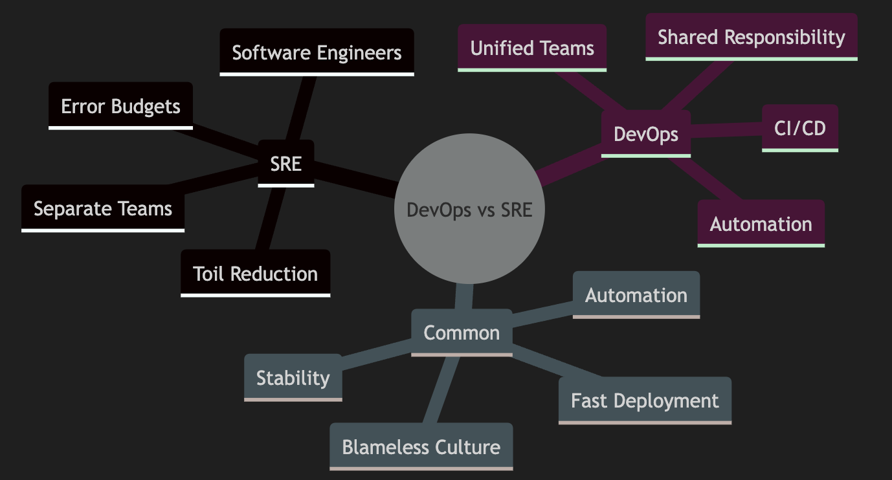

# DevOps vs Site Reliability Engineering (SRE)

This articles explores the relationship between DevOps and Site Reliability Engineering (SRE), their differences, commonalities, and how they work together


## Key Differences

### Team Structure
- **SRE**: Maintains separate DEV and OPS teams with shared staffing pool
- **DevOps**: Single unified team with shared responsibilities

### Stability Management
- **SRE**: Uses error budgets (based on SLOs)
- **DevOps**: Uses automation and "you build it, you run it" philosophy

## Common Goals
1. Production visibility across teams
1. Blameless culture
1. Faster deployments with stability
1. Infrastructure automation

## Practical Examples

### SRE Error Budget Example
```python
SLA = 99.9%  # Service Level Agreement
monthly_downtime_budget = 44  # seconds
if monthly_outages > monthly_downtime_budget:
    freeze_deployments()
```

### Infrastructure as Code Example
```yaml
# SRE Automation Example
resource "aws_instance" "web_server" {
  ami           = "ami-0c55b159cbfafe1f0"
  instance_type = "t2.micro"
  
  tags = {
    Name = "Automated-Web-Server"
  }
}
```

## Architecture Diagrams

### Team Structure Comparison


### Integration Model


### Concept Mindmap


## Best Practices
1. SRE teams should focus on infrastructure and platform services
2. DevOps teams should consume platform services for application deployment
3. Maintain error budgets for production stability
4. Automate repetitive tasks
5. Implement blameless post-mortems
6. Regular rotation of developers through operations (SRE model)
7. Continuous monitoring and feedback loops

## Tools & Technologies
- Infrastructure as Code: Terraform, CloudFormation
- Monitoring: Prometheus, Grafana
- Automation: Ansible, Chef, Puppet
- CI/CD: Jenkins, GitLab CI, GitHub Actions
- Version Control: Git
```