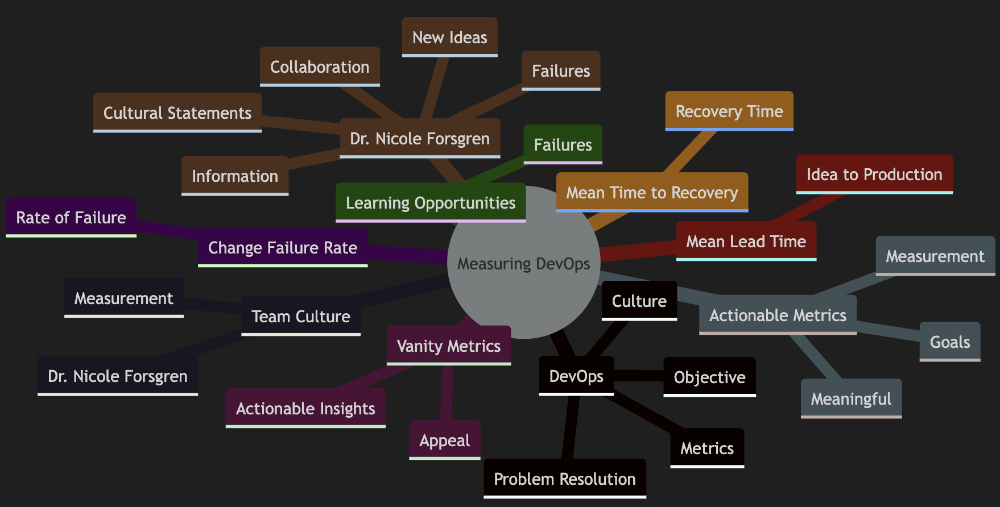
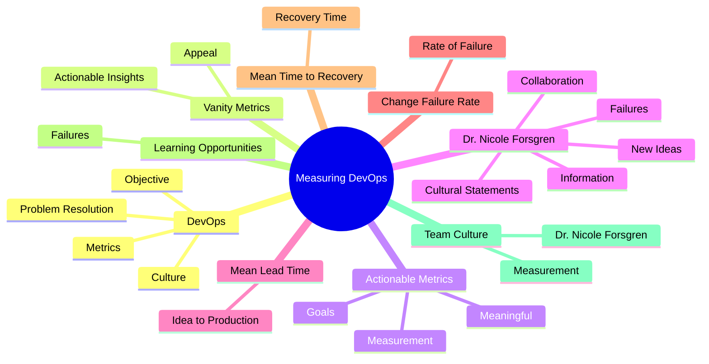

# Measuring DevOps Takeaways

Let's review the key takeaways from the Measuring DevOps section:

1. Measure and reward what you want to improve

1. People seek information on what is rewarded and then seek to do that

1. Measuring social metrics leads to improved teamwork and measuring DevOps metrics allows you to see the progression toward your goals

1. If you want people to be social, then measure them being social. If you want people to be productive, then measure them being productive

1. DevOps changes the objective of problem resolution from failure prevention to failure recovery

1. Vanity metrics may be appealing at first but offer limited actionable insights

1. Actionable metrics provide meaningful ways to measure your processes and take action toward goals. 

1. DevOps actionable metrics include mean lead time, release frequency, change failure rate, and mean time to recovery

1. You can rate statements developed by Dr. Nicole Forsgren to measure your team’s culture, including statements about information, failures, collaboration, and new ideas

1. Mean lead time is the measure of how long it takes for an idea to get to production

1. Change failure rate is the rate of failure from pushing new releases out

1. Mean time to recovery is how long it takes to recover from a failure.

1. Failures are learning opportunities that should not be punished

1. Dr. Nicole Forsgren developed cultural statements for measuring team culture 

# Diagrams

# Chart 

```mermaid
flowchart LR
    subgraph Measuring DevOps Takeaways
        A[Measure and Reward] --> |Improve| B[What You Want]
        B --> |Seek Information| C[What is Rewarded]
        C --> |Seek to Do| D[That]
        D --> |Measuring Social Metrics| E[Improved Teamwork]
        E --> |Measuring DevOps Metrics| F[Progression Toward Goals]
        F --> |Measure Social| G[Social]
        G --> |Measure Productive| H[Productive]
        H --> |DevOps Objective| I[Problem Resolution]
        I --> |Failure Prevention| J[Failure Recovery]
        J --> |Vanity Metrics| K[Appealing]
        K --> |Limited Insights| L[Actionable Metrics]
        L --> |Meaningful| M[Measurement]
        M --> |DevOps Metrics| N[Mean Lead Time]
        N --> |Release Frequency| O[Change Failure Rate]
        O --> |Mean Time to Recovery| P[Recovery Time]
        P --> |Learning Opportunities| Q[Failures]
        Q --> |Dr. Nicole Forsgren| R[Cultural Statements]
        R --> |Information| S[Information]
        S --> |Failures| T[Failures]
        T --> |Collaboration| U[Collaboration]
        U --> |New Ideas| V[New Ideas]
        V --> |Mean Lead Time| W[Idea to Production]
        W --> |Change Failure Rate| X[Rate of Failure]
        X --> |Mean Time to Recovery| Y[Recovery Time]
        Y --> |Learning Opportunities| Z[Failures]
        Z --> |Team Culture| AA[Measurement]
        AA --> |Dr. Nicole Forsgren| AB[Dr. Nicole Forsgren]
    end
```

