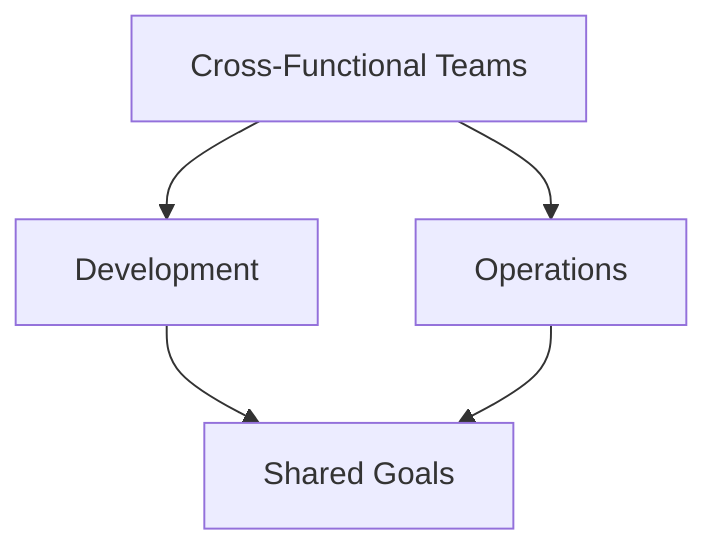
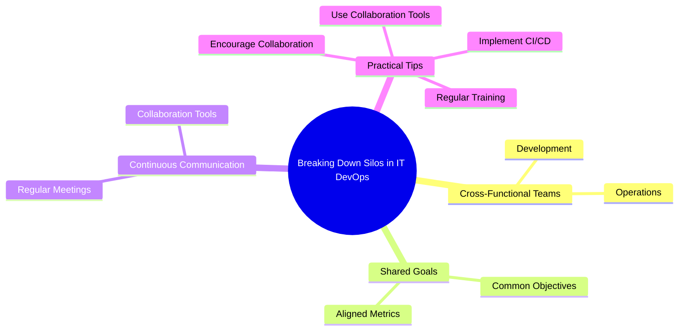

# What is working in silos?

1. "Working in silos" refers to a situation where different teams or departments operate independently and do not share information, goals, tools, or processes with each other
This lack of collaboration can lead to inefficiencies, miscommunication, and a slower overall workflow
1. In traditional IT environments, development and operations teams often work in silos. Development teams focus on creating and updating software, while operations teams manage the infrastructure and ensure system stability. These teams may have different priorities and goals, leading to a disconnect that can hinder the overall progress of projects

### Emxaple - the Pain of Silos

Imagine a scenario where the development team is working on a new feature for an application. They complete the coding and pass it on to the operations team for deployment. However, the operations team discovers that the new feature requires additional infrastructure that wasn't communicated earlier. This leads to delays, frustration, and a suboptimal release.

---

## Impacts of Working in Silos

1. **Reduced Efficiency**: When teams do not communicate effectively, it can lead to duplicated efforts and delays.
2. **Poor Quality**: Lack of collaboration can result in software that does not meet operational requirements, leading to more bugs and issues.
3. **Low Morale**: Teams working in isolation may feel undervalued and disconnected from the larger organizational goals

---

# Breaking Down Silos in IT

## How DevOps Breaks Down Silos

DevOps aims to eliminate these silos by promoting a culture of collaboration and shared responsibility. Here are some practical ways DevOps can help:

### 1. Cross-Functional Teams

DevOps encourages the formation of cross-functional teams that include members from both development and operations. This ensures that all perspectives are considered from the start, reducing the chances of miscommunication and delays.

### 2. Shared Goals and Metrics

1. Aligning the goals of development and operations is crucial
2. By setting shared objectives and metrics, teams can work towards common goals, ensuring that everyone is on the same page.

### 3. Continuous Communication

1. Regular meetings, stand-ups, and the use of collaboration tools help maintain open lines of communication
2. This continuous dialogue ensures that any issues are addressed promptly, and everyone is aware of the project's status

## Practical Tips for Breaking Down Silos

1. **Encourage Collaboration**: Foster a culture where team members are encouraged to collaborate and share knowledge.
2. **Implement CI/CD**: Use CI/CD pipelines to automate testing and deployment, ensuring faster and more reliable releases.
3. **Use Collaboration Tools**: Leverage tools like Slack, Jira, and Confluence to facilitate communication and project management.
4. **Regular Training**: Provide regular training sessions to keep team members updated on the latest DevOps practices and tools.

---
 d

