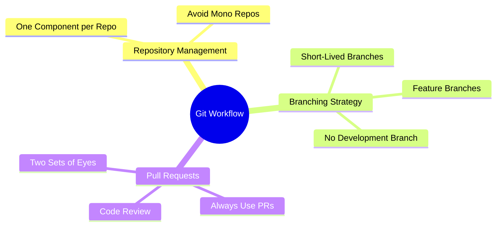

# Git Repository Guidline Workflow

Managing your Git repositories effectively is crucial for maintaining clean, efficient, and collaborative codebases. In this tutorial, we'll explore best practices for Git repository management and workflow, focusing on creating repositories, branching strategies, and using pull requests

## Table of Contents
1. Creating Repositories
2. Branching Strategy
3. Using Pull Requests
4. Practical Examples
5. Mindmap Summary

## Creating Repositories (microservices)

When working on a project, it's essential to create a separate repository for each component or microservice. This approach avoids the pitfalls of a monolithic repository (mono repo), where multiple microservices are stored in a single repository. Mono repos can lead to unnecessary complexity and inefficiency.

### Best Practices
- **One Component per Repo**: Ensure each microservice or component has its own repository.
- **Avoid Mono Repos**: Do not combine multiple microservices in one repository, as it complicates version control and deployment.

### Example
```bash
# Create a new repository for a microservice
git init my-microservice
cd my-microservice
# Add remote origin
git remote add origin https://github.com/phuongvo9/my-microservice.git
```

## Branching Strategy

A well-defined branching strategy is key to maintaining a clean and manageable codebase. The Git Feature Branch Workflow is a popular approach that supports social coding and collaboration.

### Key Points
- **Feature Branches**: Create a new branch for each feature or issue you're working on.
- **Short-Lived Branches**: Avoid long-lived branches to reduce merge conflicts and integration issues.
- **No Development Branch**: Use only the master branch and feature branches.

### Example
```bash
# Create a new feature branch
git checkout -b feature/new-feature
# Work on the feature and commit changes
git add .
git commit -m "Add new feature"
```

## Using Pull Requests

Pull requests (PRs) are an essential part of the Git workflow, enabling code review and collaboration. They ensure that code is reviewed by peers before being merged into the master branch.

### Best Practices
- **Always Use PRs**: All changes should be merged into the master branch via pull requests.
- **Code Review**: Never merge your own pull request. Have a team member review and merge it.
- **Two Sets of Eyes**: Ensure every piece of code is reviewed by at least two people.

### Example
```bash
# Push the feature branch to the remote repository
git push origin feature/new-feature
# Create a pull request on GitHub
# (This step is done through the GitHub web interface)
```

## Practical Examples

Let's look at a practical example of managing a Git repository for a microservice project.

### Scenario
You are developing a microservice for user authentication. Follow these steps to manage your repository and workflow:

1. **Create a Repository**: Initialize a new Git repository for the authentication microservice.
2. **Create a Feature Branch**: Develop a new feature for user login.
3. **Submit a Pull Request**: Push the feature branch and create a pull request for code review.

### Steps
```bash
# Step 1: Create a Repository
git init auth-service
cd auth-service
git remote add origin https://github.com/phuongvo9/auth-service.git

# Step 2: Create a Feature Branch
git checkout -b feature/user-login
# Implement the user login feature
git add .
git commit -m "Implement user login feature"

# Step 3: Submit a Pull Request
git push origin feature/user-login
# Create a pull request on GitHub for code review
```

## Mindmap Summary

