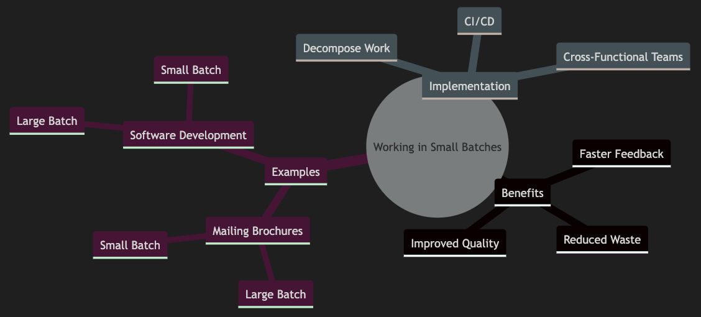
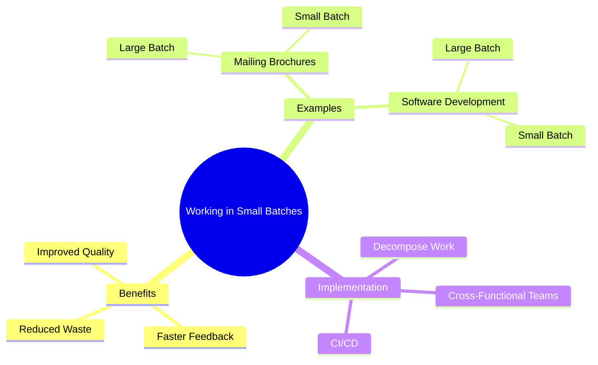

# Working in Small Batches: A Practical Guide

1. Working in small batches is a key concept from Lean Manufacturing that has been widely adopted in software development and DevOps practices
1. It emphasizes the importance of fast feedback and minimizing waste by breaking down work into smaller, manageable pieces
 
This tutorial will explore the benefits of working in small batches and provide practical examples to illustrate its application

## Why Work in Small Batches?

### Faster Feedback

When you work in small batches, you receive feedback more quickly. This allows you to learn from your decisions and make necessary adjustments before investing too much time and resources.

### Reduced Waste

Small batches help minimize waste by ensuring that you only develop what is needed. This prevents spending months on features or products that may not meet customer needs.

### Improved Quality

By inspecting and testing smaller increments of work, you can catch and fix issues earlier in the process, leading to higher quality outcomes.

## Practical Examples

### Example 1: Mailing Brochures

Let's compare the process of mailing brochures in large batches versus small batches.

#### Large Batch Process

1. **Fold 50 brochures**: Takes 5 minutes.
2. **Insert brochures into envelopes**: Takes 5 minutes.
3. **Seal envelopes**: Takes 5 minutes.
4. **Stamp envelopes**: Takes 5 minutes.

Total time to complete the first batch: 20 minutes.

#### Small Batch Process

1. **Fold one brochure**: Takes 6 seconds.
2. **Insert brochure into envelope**: Takes 6 seconds.
3. **Seal envelope**: Takes 6 seconds.
4. **Stamp envelope**: Takes 6 seconds.

Total time to complete the first brochure: 24 seconds.

With small batches, you can inspect and verify each brochure immediately, ensuring quality and catching errors early

### Example 2: Software Development

#### Large Batch Process

1. **Develop a feature**: Takes 2 weeks
2. **Test the feature**: Takes 1 week
3. **Deploy the feature**: Takes 1 week

Total time to release: 4 weeks.

#### Small Batch Process

1. **Develop a small feature or user story**: Takes 2 days.
2. **Test the feature**: Takes 1 day.
3. **Deploy the feature**: Takes 1 day.

Total time to release: 4 days.

By working in small batches, you can release features more frequently, gather user feedback, and iterate quickly.

## Implementing Small Batches in Your Workflow

### Decompose Work

Break down your tasks into smaller, manageable pieces. Ensure that each piece can be completed within a short time frame, ideally within a week or less.

### Continuous Integration and Delivery

Adopt continuous integration and continuous delivery (CI/CD) practices to automate testing and deployment. This supports the rapid release of small batches.

### Cross-Functional Teams

Encourage collaboration across different functions (development, testing, operations) to streamline the workflow and reduce handoff delays.

## Mind Map Summary

## In short

Working in small batches is a powerful approach that can lead to faster feedback, reduced waste, and improved quality. By breaking down work into smaller pieces and adopting practices like CI/CD and cross-functional teams, you can enhance your workflow and deliver value more efficiently.