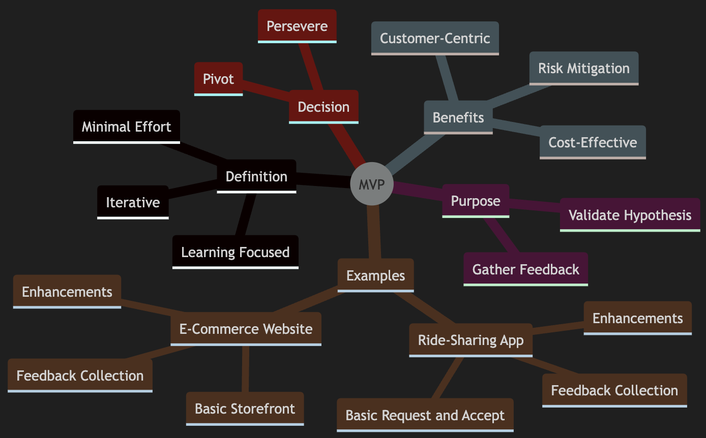
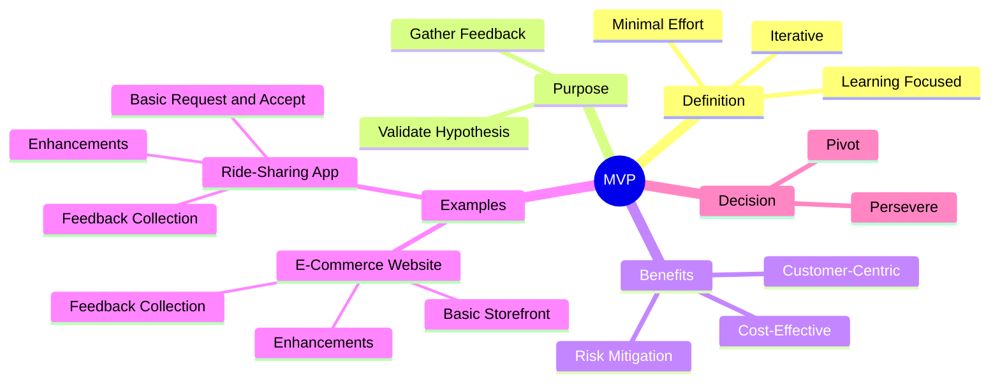

# Minimum Viable Product (MVP)

An MVP (Minimum Viable Product) is the simplest version of a product that can be released to test a value hypothesis and gain insights. Let's explore the essentials of MVPs, their purpose, and how to effectively use them with practical examples

## What is an MVP?

An MVP is not just the first phase of a project or a beta version. It is the minimal effort required to test a hypothesis and learn from it. The goal is to validate assumptions about a product's value proposition with the least amount of work

### Key Characteristics of an MVP

- **Minimal Effort**: The smallest set of features needed to test a hypothesis
- **Learning Focused**: Designed to gather feedback and insights
- **Iterative**: Involves multiple iterations based on feedback

## Why Use an MVP?

1. The primary purpose of an MVP is to learn what customers truly want
2. By releasing a basic version of the product, we can gather valuable feedback and make informed decisions about future development

### Benefits of an MVP

- **Cost-Effective**: Reduces development costs by focusing on essential features
- **Risk Mitigation**: Identifies potential issues early
- **Customer-Centric**: Ensures the product meets customer needs

## Pivot or Persevere

After each MVP iteration, decide whether to pivot (change direction) or persevere (continue on the current path). This decision is based on the feedback and insights gathered from the MVP.

---

## Practical Examples of MVPs

### Example 1: Ride-Sharing App

Imagine developing a ride-sharing app. Start with a basic version that allows users to request rides and drivers to accept them. The goal is to test the core functionality and gather insights

#### Iteration Steps
1. **Basic Request and Accept**: Users can request rides, and drivers can accept them.
2. **Feedback Collection**: Gather user feedback on the request process.
3. **Enhancements**: Add features like ride tracking and payment integration.

#### Pivot or Persevere
- **Pivot**: If users express more interest in scheduling rides in advance rather than immediate requests, consider pivoting to include ride scheduling as a priority feature.
- **Persevere**: If feedback highlights satisfaction with the request and accept functionality, continue enhancing related features, like driver ratings or estimated time of arrival.

---

### Example 2: E-Commerce Website

An MVP for an e-commerce website might be a simple online store with limited products and essential features like product listings and a checkout process.

#### Iteration Steps
1. **Basic Storefront**: List a few products with a simple checkout system.
2. **Feedback Collection**: Collect insights on the shopping experience and usability.
3. **Enhancements**: Add features like product reviews, advanced search, or inventory tracking.

#### Pivot or Persevere
- **Pivot**: If users prefer browsing curated product collections or social shopping, pivot toward incorporating those features instead of expanding the product catalog.
- **Persevere**: If users praise the simplicity of the checkout process, focus on scaling the product range and improving backend efficiency.

---

### Example 3: Online Language Learning Platform

For a language learning platform, the MVP could start with basic beginner-level lessons and simple exercises.

#### Iteration Steps
1. **Core Lessons**: Offer foundational vocabulary and grammar for one language.
2. **Feedback Collection**: Understand the challenges learners face and their needs.
3. **Enhancements**: Introduce audio pronunciation, quizzes, or progress trackers.

#### Pivot or Persevere
- **Pivot**: If learners show interest in live sessions with tutors, pivot to include this feature in future iterations.
- **Persevere**: If users appreciate the structured lessons, continue building higher-level lessons and gamifying the experience.

---

### Example 4: Fitness App

An MVP for a fitness app might include a few basic workout routines and a progress tracker.

#### Iteration Steps
1. **Basic Workouts**: Include 5-10 workout routines and a simple progress tracker.
2. **Feedback Collection**: Gather user input on workout variety and app usability.
3. **Enhancements**: Add features like personalized plans, video tutorials, and social challenges.

#### Pivot or Persevere
- **Pivot**: If users demand diet and nutrition tracking alongside workouts, pivot to include meal planning features.
- **Persevere**: If users praise the ease of following routines, focus on expanding the workout library and integrating fitness device compatibility.

---

### Example 5: Community Discussion Forum

Start with a basic website that lets users register, create topics, and post replies.

#### Iteration Steps
1. **Core Functionality**: Enable user registration, topic creation, and comment replies.
2. **Feedback Collection**: Analyze how users interact and what features they request.
3. **Enhancements**: Add upvoting, notifications, or user profiles.

#### Pivot or Persevere
- **Pivot**: If users request live chat or instant messaging, pivot toward integrating real-time communication.
- **Persevere**: If the community thrives with the current structure, enhance the interface and add moderation tools.

---

## Key Takeaways

- **MVP as a Learning Tool**: An MVP is not just about delivering; it’s about learning and iterating.
- **Pivot or Persevere**: Use feedback to decide whether to change direction or build on the current approach.
- **User-Centric Approach**: Engage with users at every step to ensure your product evolves to meet their needs effectively.

---

## Summary

An MVP is a powerful tool for learning and validating assumptions in product development. By focusing on minimal effort and iterative learning, you can create products that truly meet customer needs. Remember, the goal is to learn and adapt, ensuring your product evolves based on real user feedback

