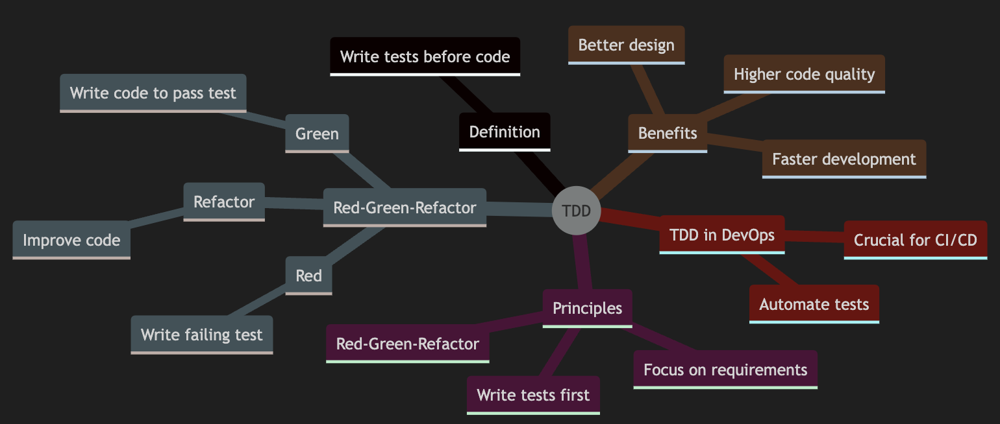
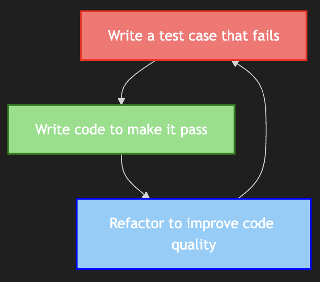
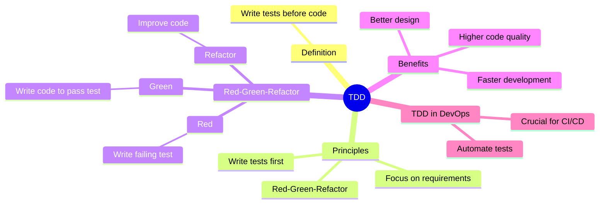
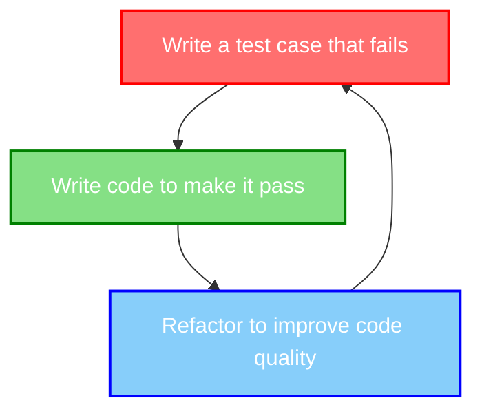

# Test-Driven Development (TDD)

1. Test-Driven Development (TDD) is a software development approach where tests are written before the code itself. 
1. This methodology ensures that the code meets its requirements and behaves as expected


In this blog, we'll explore the principles of TDD, the Red-Green-Refactor cycle, and provide practical examples to illustrate its benefits



---

## What is Test-Driven Development?

TDD is a development technique where we write a test for the functionality we want to implement before writing the actual code. This approach helps in designing better software and ensures that the code is thoroughly tested from the start.

### Key Principles of TDD

- **Write tests first**: Define the desired behavior of the code through tests
- **Red-Green-Refactor cycle**: Follow a structured workflow to develop and refine code
- **Focus on requirements**: Ensure that the code meets the specified requirements



## The Red-Green-Refactor Cycle

The Red-Green-Refactor cycle is the core workflow of TDD. It consists of three main steps:

1. **Red**: Write a failing test case for the new functionality
2. **Green**: Write the minimum amount of code required to pass the test
3. **Refactor**: Improve the code while ensuring that all tests still pass

---

### Practical Example

Let's walk through a simple example to illustrate the Red-Green-Refactor cycle.

#### Step 1: Red

Write a test case for a function that checks if a number is even.

```python
def test_is_even():
    assert is_even(4) == True
    assert is_even(5) == False
```

Run the test, and it will fail because the `is_even` function does not exist yet.

#### Step 2: Green

Implement the `is_even` function to pass the test.

```python
def is_even(number):
    return number % 2 == 0
```

Run the test again, and it should pass.

#### Step 3: Refactor

Refactor the code to improve its readability or performance while ensuring the test still passes.

```python
def is_even(number):
    return (number % 2) == 0
```

## Benefits of TDD

### Higher Code Quality

TDD encourages writing tests that define the desired behavior of the code, leading to higher-quality software. By writing tests first, developers are forced to think about the requirements and design before implementation

### Faster Development

Although writing tests initially takes time, TDD can speed up development in the long run. Automated tests catch bugs early, reducing the time spent on debugging and maintenance

### Better Design

TDD promotes better software design by encouraging developers to write modular and testable code. This approach leads to cleaner, more maintainable codebases

## TDD in DevOps

TDD is crucial for DevOps practices, particularly in Continuous Integration (CI) and Continuous Delivery (CD) pipelines. Automated tests ensure that code changes do not introduce new bugs, enabling faster and more reliable deployments


### Automating Tests

To fully leverage TDD in a DevOps environment, it's essential to automate tests. Automated tests provide quick feedback on code changes, allowing teams to detect and fix issues early.


---

## Mindmap Summary




---

