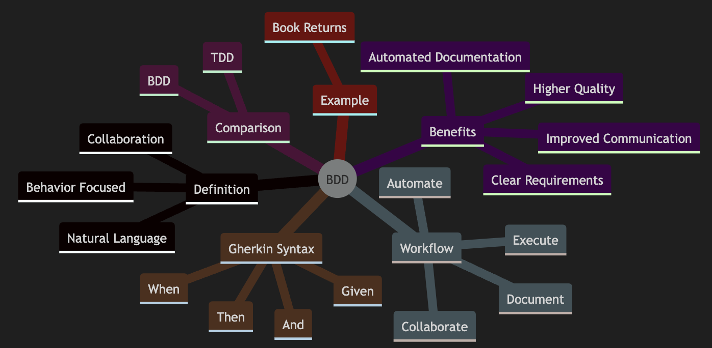
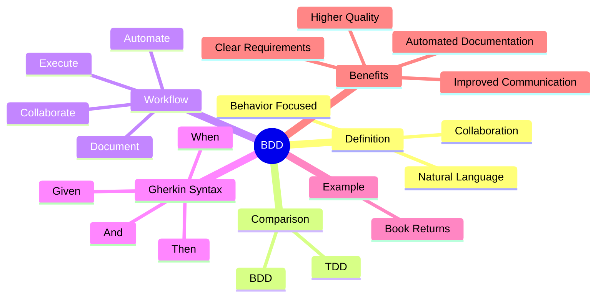
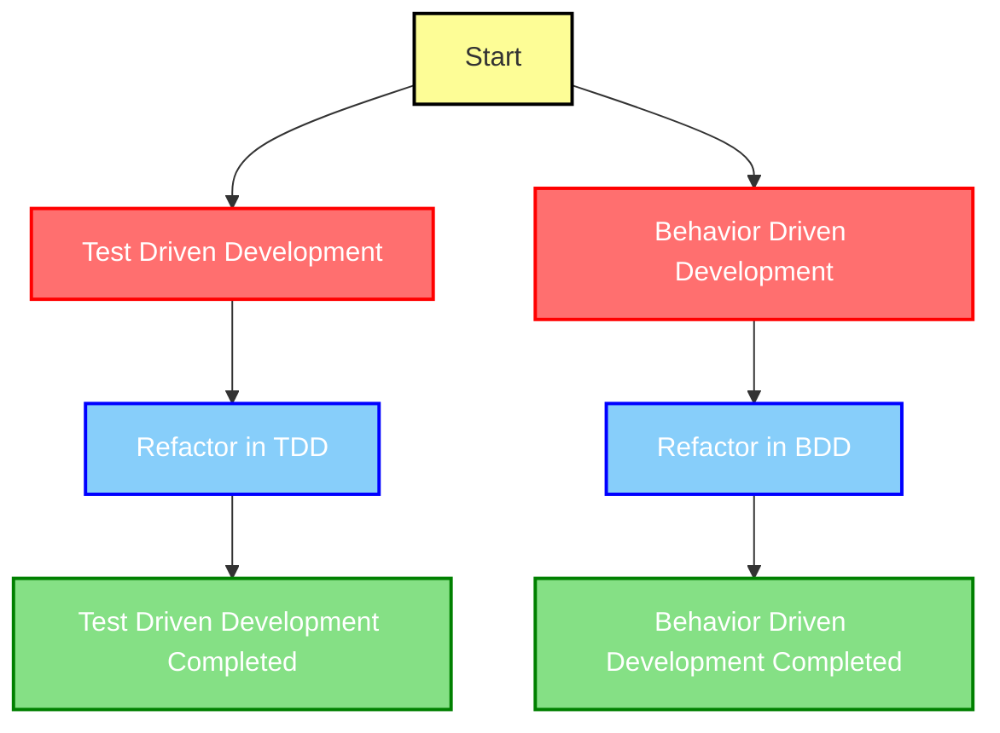

# Behavior Driven Development (BDD)

1. Behavior Driven Development (BDD) is a software development approach that emphasizes collaboration among developers, testers, and business stakeholders
2. BDD focuses on the behavior of the system from the user's perspective, ensuring that the software meets the desired business outcomes
3. BDD is a development methodology that encourages writing tests in a natural language that non-technical stakeholders can understand. This approach bridges the communication gap between technical and non-technical team members, ensuring that everyone has a clear understanding of the system's behavior

### Key Concepts of BDD

- **Behavior Focused**: BDD focuses on the behavior of the system as observed from the outside in
- **Collaboration**: Encourages collaboration between developers, testers, and business stakeholders
- **Natural Language**: Uses a natural language syntax (Gherkin) to write test cases



## BDD vs TDD

While Test Driven Development (TDD) focuses on testing the internal workings of the system, BDD emphasizes the external behavior. TDD ensures that each component works correctly, whereas BDD ensures that all components work together to meet business requirements

### Comparison

- **TDD**: Tests the internal functions of the system
- **BDD**: Tests the system's behavior from the user's perspective

## The BDD Workflow

The BDD workflow involves the following steps:

1. **Collaborate**: Developers, testers, and business stakeholders collaborate to explore the problem domain and define the desired behavior
2. **Document**: Document the behaviors using Gherkin syntax
3. **Automate**: Use BDD tools like Cucumber, Behave, or jBehave to automate the tests
4. **Execute**: Run the tests to validate the system's behavior

### Example Workflow

1. **Collaborate**: Team discusses the feature "Returns go to stock"
2. **Document**: Write the feature file using Gherkin syntax
3. **Automate**: Implement the feature using a BDD tool
4. **Execute**: Run the automated tests to ensure the feature works as expected

## Gherkin Syntax

Gherkin is a natural language syntax used to describe the behavior of the system. It uses keywords like `Given`, `When`, `Then`, and `And` to structure the test cases.

### Example

```gherkin
Feature: Returns go to stock

  Scenario: Refunded items should be returned to stock
    Given a customer previously bought a black sweater from me
    And I have 3 black sweaters in stock
    When they return the black sweater for a refund
    Then I should have 4 black sweaters in stock
```

## Practical Example

Let's consider a practical example of an online bookstore. We want to ensure that when a customer returns a book, it is added back to the inventory.

### Feature: Book Returns

```gherkin
Feature: Book Returns

  Scenario: Refunded books should be returned to inventory
    Given a customer bought "The Great Gatsby"
    And there are 5 copies of "The Great Gatsby" in inventory
    When the customer returns "The Great Gatsby"
    Then there should be 6 copies of "The Great Gatsby" in inventory
```

### Implementing the Test

Using a BDD tool like Cucumber for Ruby:

```ruby
Given("a customer bought {string}") do |book|
  @book = book
  @inventory = Inventory.new
end

And("there are {int} copies of {string} in inventory") do |count, book|
  @inventory.add(book, count)
end

When("the customer returns {string}") do |book|
  @inventory.return(book)
end

Then("there should be {int} copies of {string} in inventory") do |count, book|
  expect(@inventory.count(book)).to eq(count)
end
```

## Benefits of BDD

- **Improved Communication**: Enhances communication among team members
- **Clear Requirements**: Provides clear and unambiguous requirements
- **Automated Documentation**: Generates documentation from the test cases
- **Higher Quality**: Results in higher quality code and reduced maintenance costs

## In short

1. BDD helps your software meets business requirements by focusing on the system's behavior
1. BDD bridges the gap between technical and non-technical team members, leading to better communication and higher quality software by using natural language syntax and encouraging collaboration

---

## Mindmap Summary


---
Comparison between TDD and BDD

