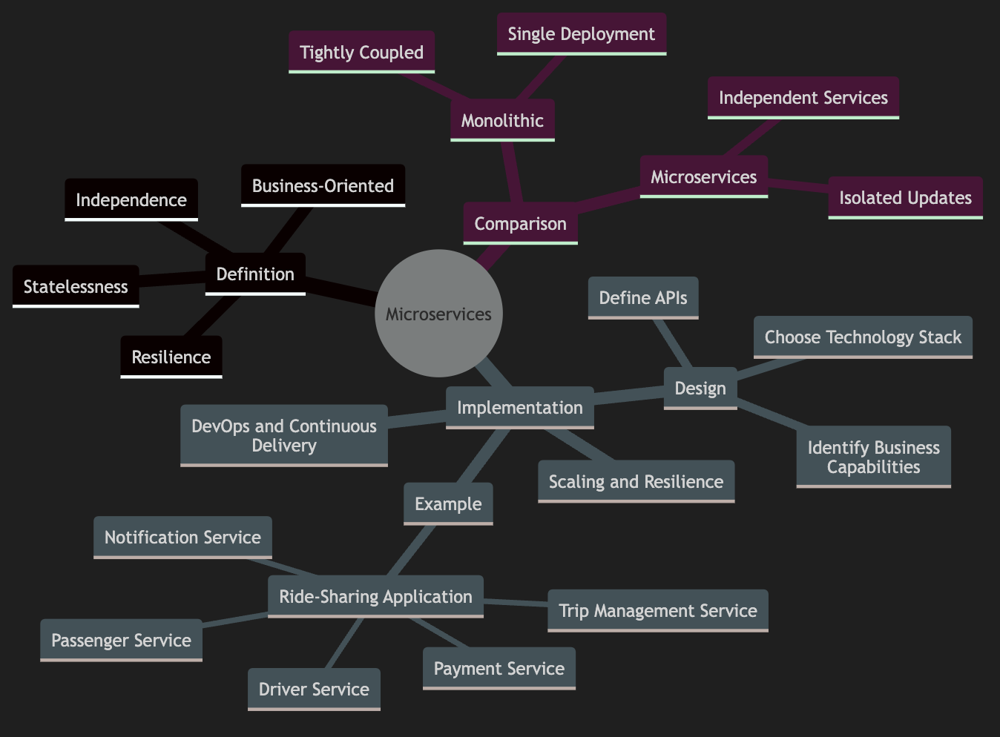
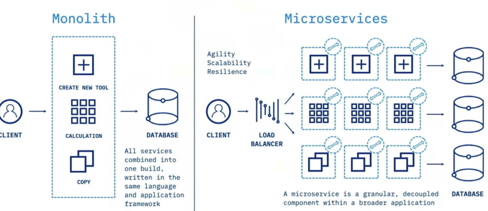
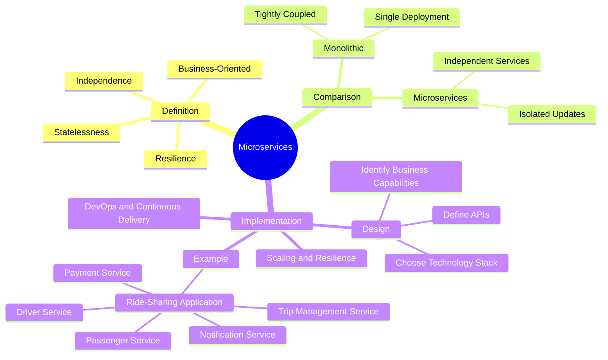

# Cloud Native Microservices

1. Microservices architecture has revolutionized the way we design and deploy applications
1. Microservices are a design approach where an application is composed of small, independent services that communicate over well-defined APIs
1. Each service is focused on a specific business capability and can be developed, deployed, and scaled independently

### Key Characteristics

- **Independence**: Each microservice operates independently, allowing for isolated updates and scaling
- **Business-Oriented**: Services are built around business capabilities, such as user management, payment processing, or notifications
- **Statelessness**: Microservices do not maintain hidden state; state is managed externally in databases or persistent stores
- **Resilience**: Services are designed to handle failures gracefully, often by deploying multiple instances

---

## Comparing Monolithic and Microservices Architectures

### Monolithic Architecture

In a monolithic architecture, all components of an application are tightly coupled and run as a single unit. This can lead to challenges in scaling, updating, and maintaining the application.

#### Example of Monolithic Architecture

Imagine an e-commerce application where user management, product catalog, and order processing are all part of a single codebase. Any change requires redeploying the entire application, and scaling specific components independently is difficult

### Microservices Architecture

1. In contrast, a microservices architecture breaks down the application into smaller, independent services
2. Each service can be developed, deployed, and scaled independently

#### Example of Microservices Architecture

1. Consider the same e-commerce application, but now user management, product catalog, and order processing are separate services
2. You can update the product catalog service without affecting the others, and scale the order processing service independently based on demand

## Implementing Microservices

### Designing Microservices

1. **Identify Business Capabilities**: Break down the application into services based on business functions
2. **Define APIs**: Establish clear, well-defined APIs for communication between services
3. **Choose Technology Stack**: Select appropriate technologies for each service, considering factors like performance, scalability, and maintainability

### Practical Example: Ride-Sharing Application

Let's design a ride-sharing application with the following microservices:

- **Driver Service**: Manages driver profiles and availability
- **Passenger Service**: Handles passenger profiles and bookings
- **Trip Management Service**: Coordinates trips between drivers and passengers
- **Payment Service**: Processes payments for trips
- **Notification Service**: Sends notifications to users

#### API Design

Each service exposes RESTful APIs for interaction. For example, the Trip Management Service might have endpoints like:

- `POST /trips`: Create a new trip
- `GET /trips/{id}`: Retrieve trip details
- `PUT /trips/{id}`: Update trip information

### Scaling and Resilience

Microservices enable independent scaling. If the Notification Service experiences high load, you can scale it independently without affecting other services. Deploy multiple instances to ensure resilience and handle failures gracefully.

### DevOps and Continuous Delivery

Leverage DevOps practices to manage the continuous delivery of microservices. Use CI/CD pipelines to automate testing, deployment, and monitoring. This ensures that updates are delivered quickly and reliably to production.

## Summary

1. Microservices offer a flexible, scalable, and resilient approach to application design. 
2. we can achieve greater agility and efficiency in development and operations by breaking down applications into independent services

---

