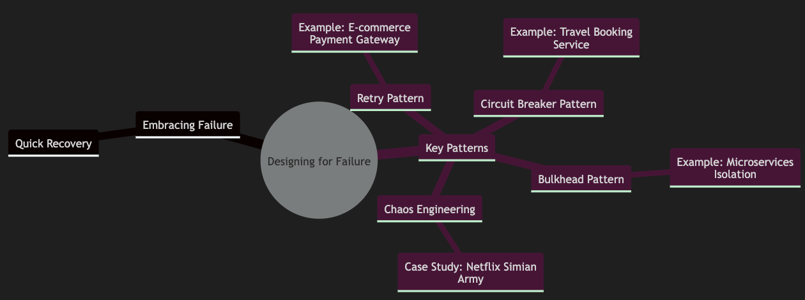
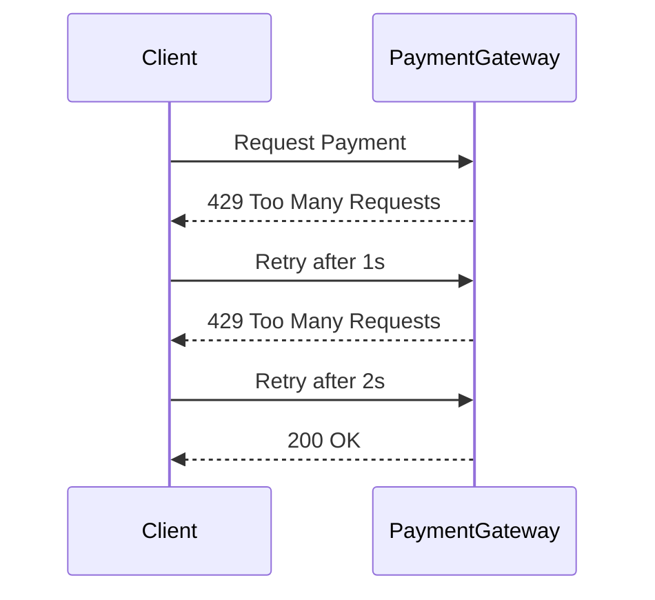
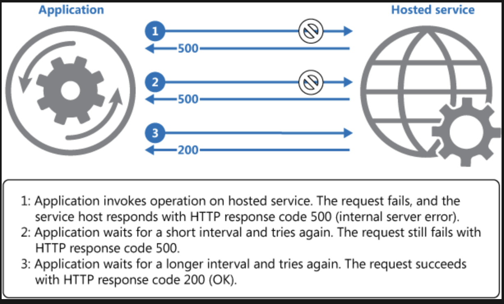
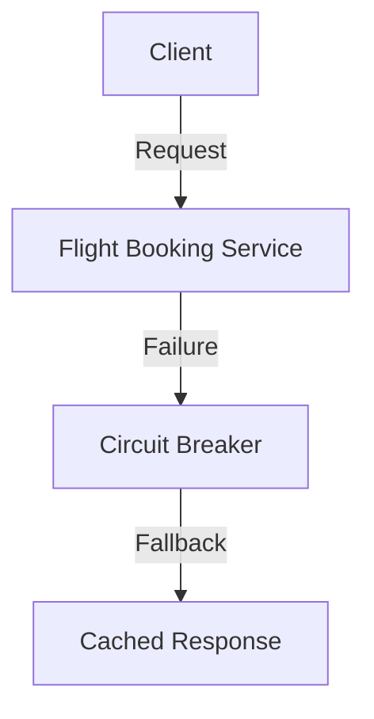
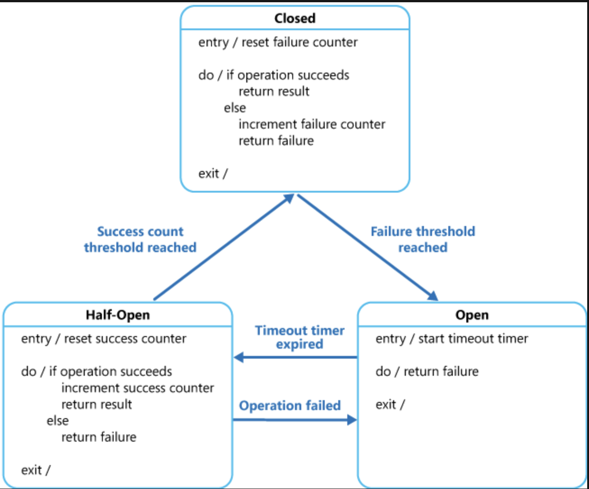
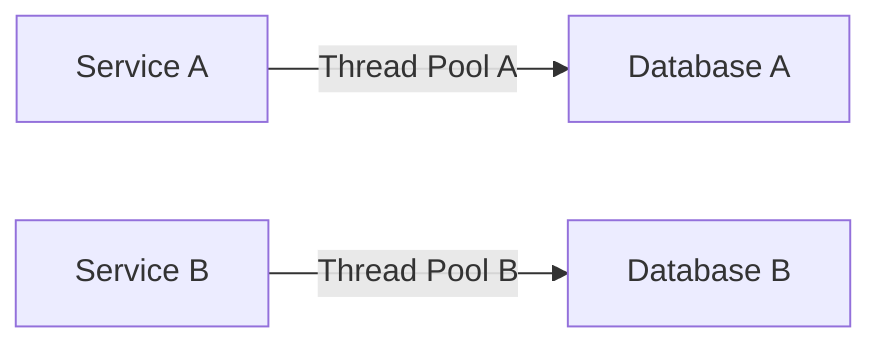
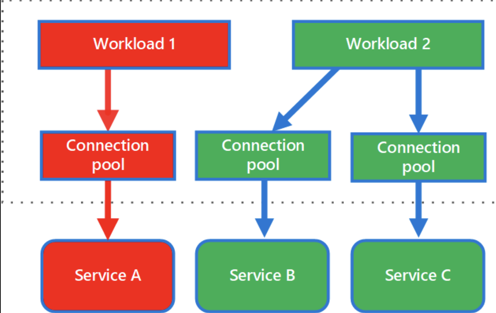
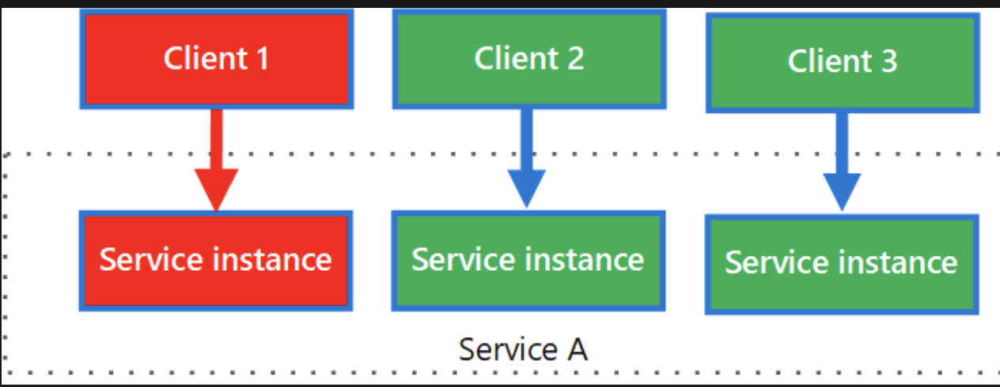
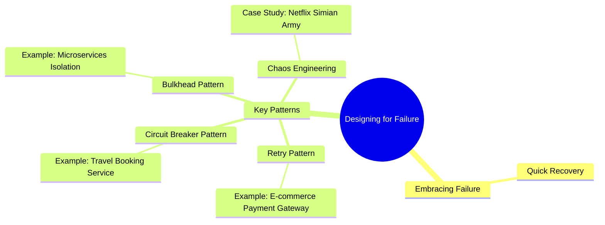

# Embracing Failure for Resilient Applications

1. Designing for failure is crucial for building resilient applications
2. By embracing failure and implementing key patterns like retry, circuit breaker, and bulkhead, we can ensure that our systems can recover quickly from failures
3. Chaos engineering further helps in identifying and addressing weaknesses in the system

---

## Embracing Failure

1. Failure is inevitable in any system. 
2. Instead of trying to avoid it, we should focus on identifying failures quickly and recovering from them efficiently. This shift in mindset is essential for building robust applications.

### Quick Recovery

1. The goal is to minimize the Mean Time to Recovery (MTTR).
2. By designing systems that can recover quickly, we ensure that failures have minimal impact on users and business operations.

---

## Key Patterns for Resilience

### Retry Pattern

1. The retry pattern helps handle transient failures by retrying operations that fail due to temporary issues like network latency or service unavailability

#### Example of Retry Pattern

Imagine an e-commerce application that relies on a payment gateway. If the payment gateway is temporarily unavailable, the application can retry the payment request with exponential backoff

Learn more at [Retry Pattern from Microsoft Architecture Patterns](https://learn.microsoft.com/en-us/azure/architecture/patterns/retry)

---

### Circuit Breaker Pattern

The circuit breaker pattern prevents cascading failures by stopping requests to a failing service and providing an alternative response

#### Example of Circuit Breaker Pattern

Consider a travel booking application that depends on a flight booking service. If the flight booking service fails, the circuit breaker can provide a cached response or a fallback service.

---

> Learn more at [Circuit Breaker Pattern from Microsoft Architecture Patterns](https://learn.microsoft.com/en-us/azure/architecture/patterns/circuit-breaker)

---

### Bulkhead Pattern

The bulkhead pattern isolates different parts of the system to prevent a failure in one part from affecting the entire system

#### When to use this pattern
Use this pattern to:
1. Isolate resources used to consume a set of backend services, especially if the application can provide some level of functionality even when one of the services is not responding.
1. Isolate critical consumers from standard consumers.
1. Protect the application from cascading failures.

This pattern may not be suitable when:
1. Less efficient use of resources may not be acceptable in the project.
1. The added complexity is not necessary

#### Example of Bulkhead Pattern

In a microservices architecture, different services can be isolated using separate thread pools. If one service fails, it doesn't impact the others.

> Learn more at [Bulkhead Pattern from Microsoft Architecture Patterns](https://learn.microsoft.com/en-us/azure/architecture/patterns/bulkhead)

> The following diagram shows bulkheads structured around connection pools that call individual services. If Service A fails or causes some other issue, the connection pool is isolated, so only workloads using the thread pool assigned to Service A are affected. Workloads that use Service B and C are not affected and can continue working without interruption

The next diagram shows multiple clients calling a single service. Each client is assigned a separate service instance. Client 1 has made too many requests and overwhelmed its instance. Because each service instance is isolated from the others, the other clients can continue making calls

---

### Chaos Engineering

Chaos engineering involves deliberately introducing failures to test the system's resilience. This practice helps identify weaknesses and improve the system's ability to handle real-world failures.

#### Case Study: Netflix

Netflix uses a suite of tools called the Simian Army to randomly terminate instances and test the system's resilience. This approach ensures that their services can recover gracefully from unexpected failures

## Mindmap of this blog

