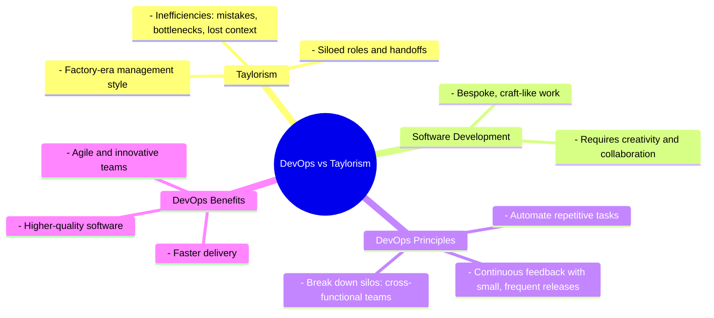

# Case Against Taylorism in Software Development: Why DevOps Is the Future

## The Downside of Taylorism in Software Development

   Taylorism, named after Frederick Winslow Taylor, revolutionized manufacturing during the industrial revolution by introducing assembly lines and a command-and-control management style. Workers were divided into specialized roles, which maximized efficiency in repetitive, standardized tasks like car assembly. Managers planned and directed, while workers executed pre-defined tasks. While effective for factories, this approach has persisted in software development, where it creates significant challenges

## Why Taylorism Fails in Software Development
Unlike manufacturing, software development involves creating something entirely new. Most software components are bespoke, requiring creativity and problem-solving. The fragmented workflows of Taylorism introduce:

- **Mistakes and Bottlenecks:** Each handoff increases the risk of errors and delays
- **Lost Context:** Key information is often lost when moving work between silos
- **Lack of Agility:** Siloed teams struggle to adapt quickly to change

Steve Jobs succinctly criticized Taylorism's approach: *"It doesn’t make sense to hire smart people and then tell them what to do; we hire smart people so they can tell us what to do."*

### Assembly Line vs. Software Development

1. In an assembly line, each worker performs a specific task, such as attaching doors or windows to cars. This specialization boosts efficiency but doesn't translate well to software development, where tasks are often unique and require creative problem-solving

## The DevOps Approach

DevOps emphasizes collaboration, automation, and continuous feedback, breaking down the silos that Taylorism creates.

### Use case: DevOps in Action

1. Imagine a company struggling with traditional software deployment practices. Each release requires developers to write code, testers to validate it, and operations teams to deploy it—all working in isolation. Communication is minimal, and handoffs between these teams introduce delays and misunderstandings. This siloed approach, rooted in Taylorism's division of labor, often results in slow, error-prone deployments.

2. Now, picture the same company adopting DevOps principles. Collaboration becomes a core value, with cross-functional teams working together throughout the development lifecycle. Automation tools are introduced to handle repetitive tasks, such as testing and deployment, ensuring consistency and reducing human error. Continuous feedback loops provide real-time insights, enabling teams to detect and resolve issues early.

3. The results are transformative. Instead of waiting weeks or months for a release, the company deploys updates multiple times a day with confidence. Errors that once disrupted operations are caught and fixed quickly. Most importantly, the silos that hindered innovation and agility are replaced by a culture of collaboration and shared ownership. By embracing DevOps, the company moves faster, delivers higher-quality software, and adapts to change with ease.

## DevOps: Collaboration Over Command-and-Control
DevOps challenges Taylorism by fostering a culture of collaboration, agility, and continuous feedback. Instead of isolated roles, DevOps emphasizes shared goals, cross-functional teams, and automation:

### 1. **Breaking Down Silos**
DevOps teams work collaboratively across disciplines, eliminating inefficiencies from handoffs. Developers, testers, operations, and security collaborate to deliver value seamlessly

### 2. **Relentless Automation**
Automation ensures repetitive tasks—such as testing, deployment, and monitoring—are performed consistently and rapidly. This minimizes human error and accelerates delivery

### 3. **Continuous Feedback**
Frequent, small releases enable teams to gather user feedback quickly, identify issues, and adapt. This minimizes risk and maximizes learning

---

## Craftwork, Not Factory Work
Software development resembles craftwork more than factory work. Each application is unique, requiring creative solutions. DevOps recognizes this by empowering teams to innovate without rigid hierarchies. Consider:

- **Trust and Ownership:** Managers set objectives but trust teams to decide the "how"
- **Rapid Iterations:** Small, frequent releases encourage experimentation and learning
- **Shared Responsibility:** Teams take collective ownership of quality and performance

---

### Mindmap Summary

