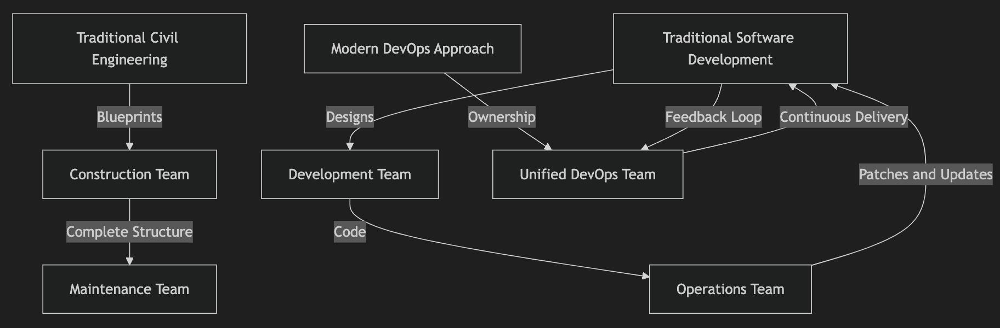

# Bridging the Gap: Why Software Engineering is Not Civil Engineering

Software engineering and civil engineering are often analogized, but this comparison frequently leads to misconceptions

  > Treating software engineering like civil engineering can hinder innovation and quality. 


Let's explore:
1. Key differences between these disciplines and
2. Why modern software development should adopt a product-oriented approach



---


## Understanding the Misalignment

### Civil Engineering Workflow
In civil engineering:
- **Blueprint Design:** Architects create blueprints for structures like office buildings
- **Handoff to Construction:** These blueprints are passed to a construction team
- **Building Maintenance:** Once the structure is complete, maintenance becomes a periodic task for a dedicated team.

This linear process is stable because the environment—both physical and operational—is relatively static once the project is complete.

### Software Engineering Workflow (Traditional Approach)
In software development:
- **Architectural Design:** Software architects design system specifications.
- **Handoff to Developers:** Developers implement the specifications, often working in isolation from the architects.
- **Handoff to Operations:** Once the system is deployed, operations teams maintain it, handling patches, updates, and new features independently.

The issue here is the dynamic nature of software. Unlike buildings, software systems evolve continuously due to:
1. Operating system updates
2. Dependency changes
3. Security vulnerabilities
4. Changing user needs and new feature requests

Treating software engineering as static post-deployment leads to inefficiencies, such as lack of ownership and poor long-term system quality.

---

## Why Software Engineering Is Organic
Software is inherently iterative and requires ongoing collaboration. Viewing it as a living product rather than a finite project fosters:
1. **Team Ownership:** Teams that build and maintain the software develop a deeper understanding and commitment.
2. **Continuous Improvement:** Stable teams with end-to-end ownership are motivated to enhance the system proactively.
3. **Adaptability:** Dynamic systems necessitate flexible teams that can respond to changing requirements and environments.

### Real-World Example: DevOps in Action
A leading e-commerce company adopted a DevOps model:
- The same team that developed the search algorithm continued to own and maintain it.
- When customer feedback indicated latency issues, the team could quickly iterate and implement improvements without the delays typical of siloed workflows.

Contrast this with traditional methods, where separate development and operations teams might have led to finger-pointing and inefficiencies.

---

## Diagram: Comparing Workflows

```mermaid
flowchart TD
    Civil[Traditional Civil Engineering] --> |Blueprints| Construction[Construction Team]
    Construction --> |Complete Structure| Maintenance[Maintenance Team]

    Software[Traditional Software Development] --> |Designs| Dev[Development Team]
    Dev --> |Code| Ops[Operations Team]
    Ops --> |Patches and Updates| Software

    DevOps[Modern DevOps Approach] --> |Ownership| Team[Unified DevOps Team]
    Team --> |Continuous Delivery| Software
    Software --> |Feedback Loop| Team