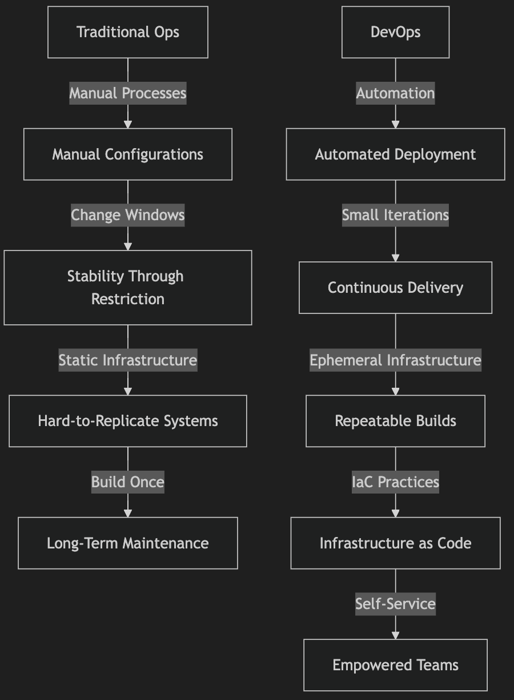
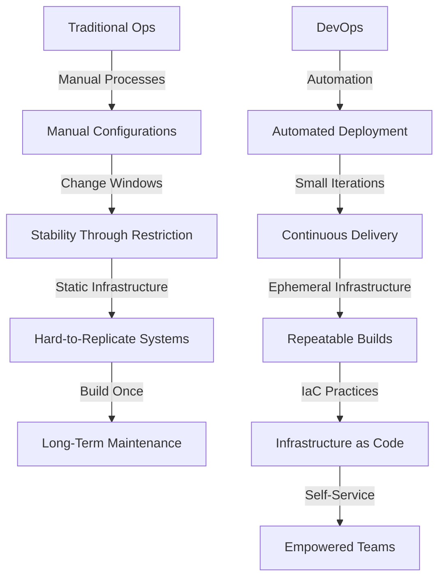

# Transforming Behaviors for Better Software Development

Traditional operations (Ops) and modern DevOps represent two fundamentally different approaches to managing software systems. While traditional Ops values stability and risk aversion, DevOps prioritizes agility, automation, and continuous collaboration. 

Let's explore:
1. the contrasts between these two paradigms
2. Cultural clashes that arise, and the behaviors needed to transition to a successful DevOps environment

---

## Traditional Ops vs. DevOps: Core Differences

### Table: Traditional Ops vs. DevOps Mindset
| **Aspect**                      | **Traditional Ops Mindset**                                                                 | **DevOps Mindset**                                                                                  |
|---------------------------------|---------------------------------------------------------------------------------------------|-----------------------------------------------------------------------------------------------------|
| **Manual Processes**            | Critical infrastructure is manually configured and maintained.                              | Deployment and management of environments are fully automated, reducing human error.                |
| **Stability Through Change Windows** | Risk is managed by restricting changes to predefined windows.                              | Risk is managed through small, frequent changes rather than large, infrequent ones.                 |
| **Static Architectures**        | Network designs dictate application architectures, leading to bespoke systems that are hard to replicate. | Application architectures dictate network configurations, often using software-defined networks.    |
| **Build-Once Philosophy**       | Infrastructure is built once and maintained for years, often with insufficient documentation for future rebuilds. | Infrastructure is built and torn down for each deployment using Infrastructure as Code (IaC)       |

### Key Takeaway:
> Traditional Ops focuses on stability and risk aversion, often leading to manual processes, static architectures, and long-term maintenance. 

> In contrast, DevOps emphasizes agility, automation, and ephemeral infrastructure, enabling rapid, iterative changes and consistent environments

---

## The Clash of Cultures: Dev vs. Ops

Andrew Clay Shafer describes the **"wall of confusion"** between development (Dev) and operations (Ops):
1. **Dev’s View of Ops:** Developers often perceive Ops as gatekeepers, delaying progress with manual processes and limited system understanding.
2. **Ops’ View of Dev:** Operations teams see developers as reckless, throwing untested code "over the wall" without proper back-out plans or production-ready environments.

### Real-Life Example of the Cultural Clash
A financial institution struggled with long delays in deploying features:
- Developers needed to submit change requests that passed through a manual review board
- Operations executed these changes manually during late-night change windows, leading to errors and blame games when things went wrong

This adversarial dynamic created inefficiencies, bottlenecks, and frustration on both sides

---

## Required DevOps Behaviors

To move past these silos and align Dev and Ops, organizations must adopt specific behaviors:

### 1. Shared Ownership and Collaboration
- **Shift from Silos:** Break down barriers and foster teamwork where everyone shares responsibility for system outcomes.
- **Unified Metrics:** Measure success based on customer value, such as uptime, performance, and feature delivery.

### 2. Embracing Change Through Small Iterations
- **From Fear to Confidence:** Transition from managing risk through restriction to managing it through incremental changes
- **Example:** A SaaS company adopted feature toggles to deploy changes progressively, reducing the impact of potential failures

### 3. Repeatable, Ephemeral Infrastructure
- **IaC Practices:** Use tools like Terraform or AWS CloudFormation / Azure ARM template to ensure environments are consistently built and rebuilt
- **Consistency:** Docker containers and virtual machines should be identical for each deployment

### 4. Automation and Self-Service
- **No More Queues:** Eliminate ticket-based systems that hinder developer productivity
- **Empowerment:** Allow teams to provision resources through self-service platforms, accelerating delivery timelines

### 5. Fast, Data-Driven Feedback Loops
- **Proactive Monitoring:** Replace reactive alarms with dashboards and alerts that provide actionable insights
- **Real-Time Adjustments:** Use continuous monitoring tools to adapt to issues dynamically

---

## Diagram: Traditional Ops vs. DevOps Behaviors

