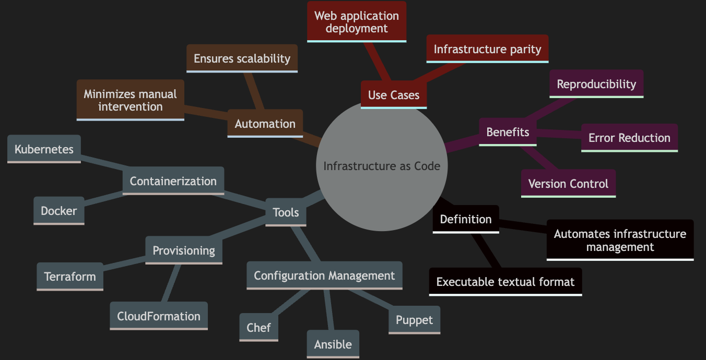

# Infrastructure as Code (IaC)

Infrastructure as Code (IaC) is a revolutionary approach to managing IT infrastructure. It involves defining  infrastructure setup—such as servers, networks, and software—in a textual format that is executable as code


---

## Key Benefits of IaC
- **Reproducibility**: Consistent recreation of environments
- **Version Control**: Collaborative change tracking and rollback
- **Error Reduction**: Automation minimizes human errors

---

## IaC Tools
- **Configuration Management Systems**: Ansible, Puppet, Chef
- **Provisioning Tools**: Terraform, CloudFormation
- **Containerization Technologies**: Docker, Kubernetes

---

## The Need for Automation
Manual configuration is labor-intensive and error-prone. With IaC:
- Use templates and scripts for consistent provisioning
- Automate repetitive tasks for scalability and reliability

---

## IaC in Action
Steps to deploy a web application:
1. Define required servers and configurations.
2. Automate installation of software dependencies.
3. Ensure environment parity between development and production.


---

## Mindmap of IaC Concepts
```mermaid
mindmap
  root((Infrastructure as Code))
    Definition
      Executable textual format
      Automates infrastructure management
    Benefits
      Reproducibility
      Version Control
      Error Reduction
    Tools
      Configuration Management
        Ansible
        Puppet
        Chef
      Provisioning
        Terraform
        CloudFormation
      Containerization
        Docker
        Kubernetes
    Automation
      Minimizes manual intervention
      Ensures scalability
    Use Cases
      Web application deployment
      Infrastructure parity