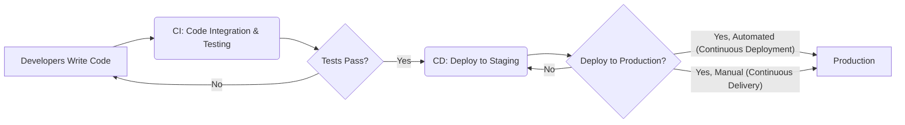
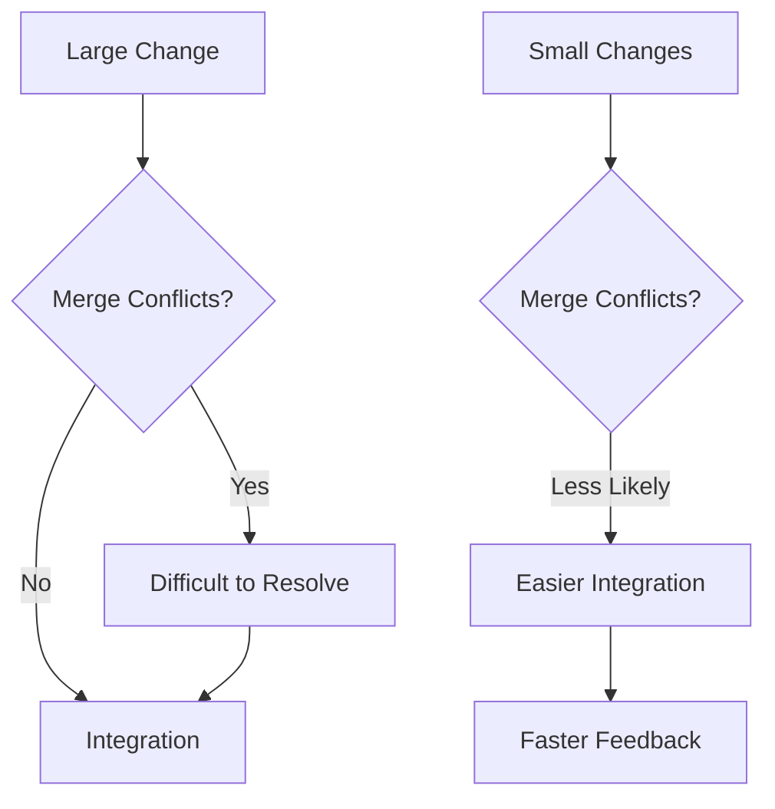
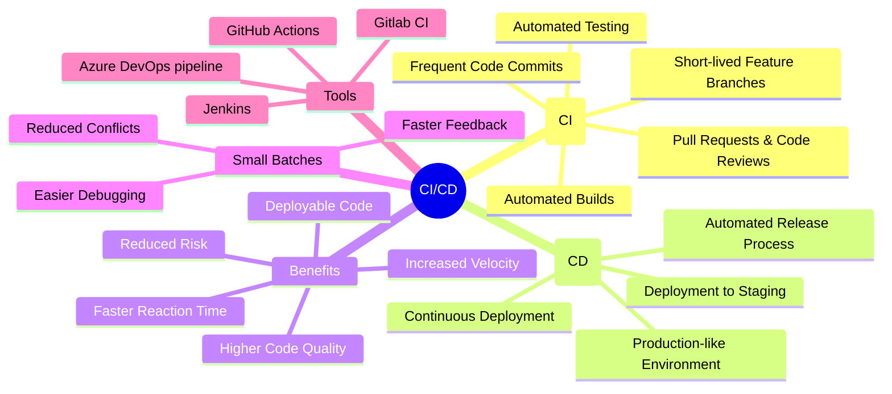

# Continuous Integration 

## Continuous Integration (CI) vs Continuous Delivery (CD)

While often used interchangeably, CI and CD represent different stages of the software delivery pipeline.

**Continuous Integration (CI)** is about merging developers' code changes frequently into a central repository, followed by automated builds and tests. The goal is to find and address bugs quicker, improve software quality, and reduce the time it takes to validate and release new software updates.

**Continuous Delivery (CD)** extends CI by automating the release process. It ensures that the code that has passed the CI phase is automatically, and safely deployed to a production-like environment. CD aims to make deployments predictable, routine affairs that can be performed on demand.

**Continuous Deployment** is a further extension of CD where every change that passes all stages of the pipeline is released to customers automatically.

### Key difference
Here is the key difference between CI and CD

## The Power of Small Batches in CI

A cornerstone of effective CI is working in small batches. This means integrating small code changes frequently rather than merging large changes at once.

### Real-world Example:

Imagine a team developing a web application. Instead of each developer working on extensive features in isolation for weeks, they break down features into smaller, manageable tasks. Each task, once completed and tested, is integrated into the main codebase daily. This approach minimizes conflicts and makes it easier to identify the source of any issues that arise.

### Why Small Batches?

*   **Reduced Conflicts:** Smaller changes mean fewer conflicts when merging code.
*   **Easier Debugging:** It's easier to pinpoint and fix issues when the changes are small and isolated.
*   **Faster Feedback:** Developers receive quicker feedback on their changes, allowing for faster iterations.

## Benefits of Continuous Integration

CI offers a multitude of benefits that streamline development and enhance software quality.

### Case Study:

A financial services company adopted CI and saw a significant reduction in integration issues. By integrating code daily and running automated tests, they were able to catch and resolve bugs early in the development cycle. This led to a 40% reduction in deployment time and a substantial decrease in post-release defects.

### Key Benefits:

*   **Faster Reaction Time:** Quick identification and resolution of issues.
*   **Increased Velocity:** Automation allows teams to move faster from development to deployment.
*   **Reduced Risk:** Smaller, frequent integrations minimize the risk of significant failures.
*   **Higher Code Quality:** Continuous testing and code reviews ensure higher quality standards.
*   **Deployable Code:** The master branch is always in a deployable state.

## Practical Implementation of CI

Implementing CI involves several key practices:

1. **Frequent Code Commits:** Developers commit code to the shared repository multiple times a day.
2. **Automated Builds:** Every commit triggers an automated build process.
3. **Automated Testing:** Comprehensive tests are run automatically after each build.
4. **Short-lived Feature Branches:** Developers work on new features in short-lived branches that are merged frequently.
5. **Pull Requests and Code Reviews:** Changes are submitted via pull requests, which are reviewed by other team members.

### Tools for CI:

Several tools can facilitate CI, including:

*   **Jenkins:** An open-source automation server.
*   **Travis CI:** A cloud-based CI service.
*   **CircleCI:** Another popular cloud-based CI platform.
*   **GitHub Actions:** Integrated CI/CD directly within GitHub.

## Ensuring Deployable Code

A critical aspect of CI is ensuring that the code in the master branch is always deployable. This means that any code merged into the master branch should have passed all tests and be ready for production.

### Best Practices:

*   **No Untested Code in Master:** Never merge code into the master branch unless it has been thoroughly tested.
*   **Automated Deployment to Staging:** After passing tests, code can be automatically deployed to a staging environment that mirrors production.
*   **Production-like Environment:** The testing and staging environments should closely mimic the production environment.

## Mind Map Summary of CI/CD

## Summary

1. Continuous Integration and Continuous Delivery are transformative practices that enable development teams to deliver high-quality software faster and more reliably
2. By embracing CI/CD, organizations can streamline their development processes, reduce risks, and ultimately deliver greater value to their customers
3. Implementing CI/CD is not just about adopting new tools; it's about fostering a culture of collaboration, automation, and continuous improvement
