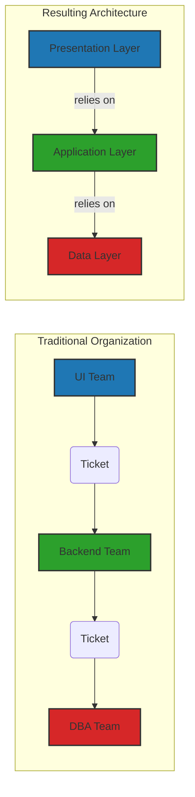
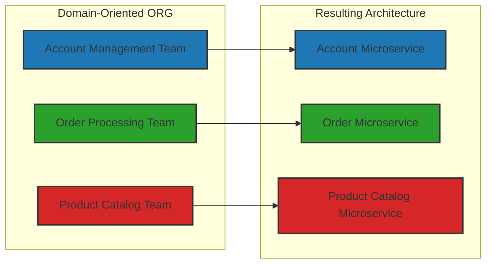
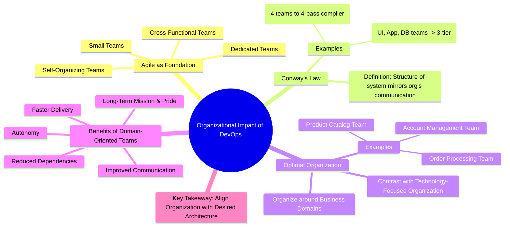
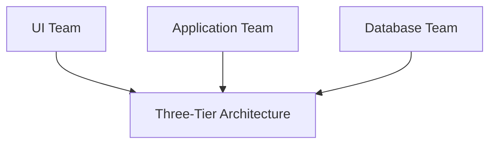
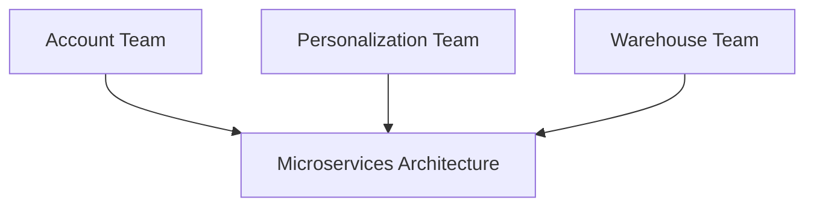

# Organizational Impact of DevOps

Effective Agile teams possess several key characteristics:

* **Small:** Think pizza-sized teams. Smaller teams (ideally 5-7, no more than 10) facilitate better communication and coordination
* **Dedicated:**  Team members should be focused on a single project or domain. Splitting attention across multiple initiatives hinders progress and focus. Imagine a developer constantly context-switching between fixing a critical bug and implementing a new feature – productivity suffers
* **Cross-Functional:**  A truly Agile team brings together all the necessary skills to deliver value independently. This includes developers, testers, operations engineers, business analysts, and potentially even UX designers. This eliminates dependencies on separate departments and speeds up the development lifecycle
* **Self-Organizing:**  Agile teams are empowered to make decisions about how they will approach their work. They commit to work within a sprint and have the autonomy to manage their tasks and deliverables

## Conway's Law: The Unseen Architect

**Conway's Law**. Coined by Melvin Conway in 1968, it states:

> "Any organization that designs a system (defined broadly) will produce a design whose structure is a copy of the organization's communication structure."

Consider these examples:

* **The Compiler Case:** If you task four separate teams to build a compiler, you're highly likely to end up with a four-pass compiler, each team responsible for one pass. This isn't necessarily the most efficient design, but it mirrors the team structure

* **The Classic Three-Tier Architecture:**  Think about traditional IT organizations with distinct teams for User Interface (UI), Application Logic (Backend), and Database Administration (DBA). Unsurprisingly, the resulting software architecture often mirrors this organizational structure, leading to a three-tier architecture. Each team focuses on their specific layer, potentially leading to bottlenecks and communication overhead. Imagine the UI team needing a simple data change – they have to raise a ticket for the DBA team, creating delays and friction.

Conway's Law isn't a suggestion; it's an observation. If you want to build software differently, you need to reorganize your teams accordingly

## The Optimal Organization for DevOps: Aligning with Business Domains

So, if organizing around technology leads to technology-centric architectures, what's the alternative for successful DevOps? The answer lies in organizing around **business domains**

Instead of having separate UI, Backend, and DBA teams, consider structuring teams around specific business capabilities or user journeys. For instance:

* **Account Management Team:**  This team would be responsible for everything related to user accounts – login, registration, profile management. They would have the necessary UI, backend, and database skills within the team to own this domain end-to-end.
* **Order Processing Team:**  This team would handle the entire order lifecycle, from cart management to payment processing and order fulfillment. Again, they'd possess the cross-functional expertise to manage their domain independently
* **Product Catalog Team:** Responsible for managing product information, inventory, and pricing across the platform. They would have the autonomy to make changes to the product catalog without relying on external teams

**Practical Example:** Imagine an e-commerce company.

* **Traditional (Technology-Focused):** They might have a Frontend Team, a Java Backend Team, and a separate Database Team. Implementing a new feature like "wishlist" would require coordination and ticketing across all three teams, leading to delays and potential miscommunication.
* **DevOps-Aligned (Domain-Focused):** They could have a "Shopping Experience" team responsible for everything related to browsing products, adding to cart, and managing wishlists. This team includes frontend developers, backend engineers, and database specialists, allowing them to implement the wishlist feature end-to-end without relying on external teams.

## Empowering Teams: The "Mini Start-up" Mentality

Organizing around business domains unlocks significant benefits:

* **Autonomy and Ownership:** Teams have complete control over their domain, fostering a sense of ownership and responsibility. They feel like "mini start-ups" within the larger organization.
* **Reduced Dependencies:**  Teams can develop and deploy features independently, minimizing the need for cross-team coordination and eliminating bottlenecks caused by ticketing systems.
* **Faster Delivery Cycles:** With fewer dependencies and streamlined communication, teams can iterate and deliver value much faster.
* **Improved Communication and Collaboration:**  Having all the necessary skills within a team fosters better communication and collaboration among members.
* **Long-Term Mission and Pride:**  Teams focused on a specific business domain develop a deeper understanding and pride in their work, leading to higher quality and more innovative solutions

**Case Study:** A large financial institution adopted a domain-driven approach for their new mobile banking application. Instead of having separate mobile developers, backend engineers, and security specialists, they formed cross-functional teams around core banking functions like "Payments," "Account Management," and "Transfers." This significantly reduced development time, improved the quality of the application, and fostered a greater sense of ownership among the team members.

## Please - Align Your Organization with Your Desired Architecture

---

# Key takeaways:

## Organizational Impact of DevOps

### Conway's Law and Team Structure

Conway's Law (1968) states:
> Any organization that designs a system will produce a design whose structure mirrors the organization's communication structure.

#### Traditional Organization (Anti-pattern)

#### DevOps Organization (Recommended)

### Key Requirements for DevOps Teams

1. **Team Size & Structure**
   - Small teams (5-7 engineers, max 10)
   - Dedicated resources
   - Cross-functional skills
   - Self-organizing

2. **Team Responsibilities**
   - End-to-end ownership
   - Full deployment control
   - Service maintenance
   - Operational support

3. **Team Alignment**
   - Business domain focus
   - Long-term mission
   - Autonomous operation
   - "Mini startup" mindset

### Implementation Checklist

- [ ] Reorganize teams around business domains
- [ ] Ensure teams have all required skillsets
- [ ] Grant full deployment autonomy
- [ ] Establish clear team missions
- [ ] Define service boundaries
- [ ] Set up monitoring and feedback loops

### Success Metrics

| Metric | Traditional | DevOps |
|--------|------------|--------|
| Deployment Frequency | Weekly/Monthly | Daily/On-demand |
| Lead Time | Weeks | Hours/Days |
| Team Autonomy | Low | High |
| Cross-skill Coverage | Siloed | Complete |

---

