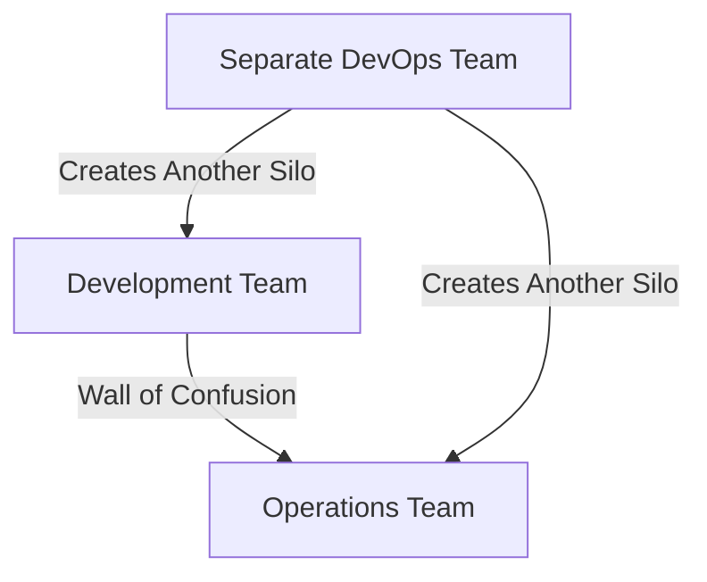
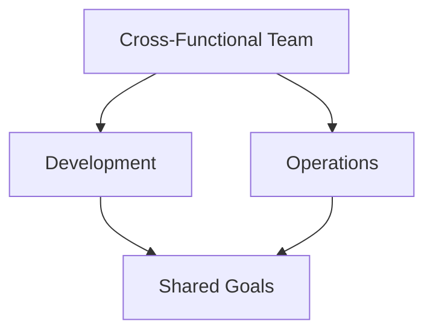

# There is no DevOps Team

## Introduction
DevOps is often misunderstood as a specific role or a separate team within an organization. However, DevOps is a cultural and organizational mindset that emphasizes collaboration between development and operations teams to deliver high-quality software continuously and stably

## Key Concepts

### What is DevOps?
DevOps is a set of practices that combines software development (Dev) and IT operations (Ops). It aims to shorten the development lifecycle and provide continuous delivery with high software quality.

### Common Misconceptions
1. **DevOps as a Role**: DevOps is not a job title or a role that one person or a team can fulfill. It is a collaborative approach that involves both development and operations teams.
2. **DevOps as a Separate Team**: Creating a separate DevOps team is an anti-pattern. It creates another silo, which contradicts the core principles of DevOps.
3. **DevOps as an Ops Function**: DevOps is not just for operations. It involves both development and operations working together throughout the software lifecycle.

### Correct Approach
DevOps should be adopted as a mindset across the entire organization. It involves:
- **Cross-Functional Teams**: Teams that include members from both development and operations.
- **Shared Goals and Measurements**: Both teams work towards common objectives and are measured by the same metrics.
- **Continuous Collaboration**: Development and operations work together throughout the entire software lifecycle.

## Diagram: Misconceptions vs. Correct Approach

### Misconceptions

### Correct Approach

## Conclusion
DevOps is not a role or a separate team but a cultural transformation that requires the entire organization to adopt a collaborative mindset. By breaking down silos and fostering cross-functional teams, organizations can achieve continuous delivery of high-quality software.

## References
- Jez Humble: "The DevOps movement addresses the dysfunction that results from organizations composed of functional silos."
- Andrew Clay Shafer: "Wall of Confusion" graphic.

By understanding and implementing these principles, your organization can effectively practice DevOps and avoid common pitfalls.