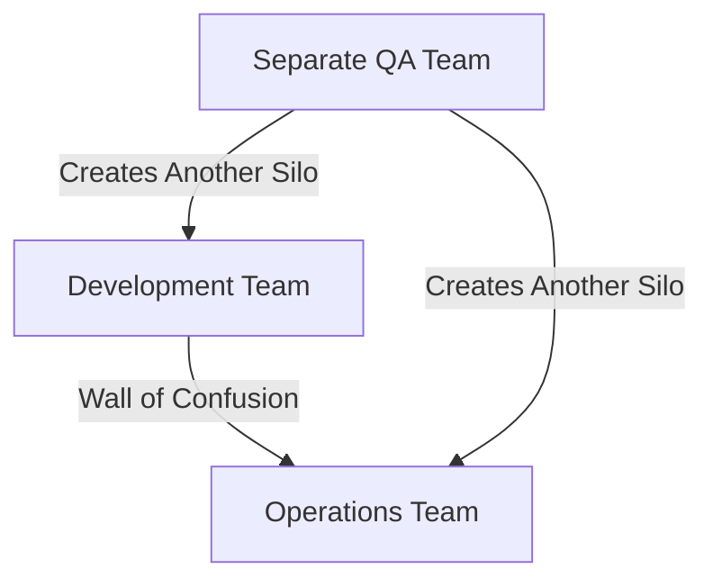
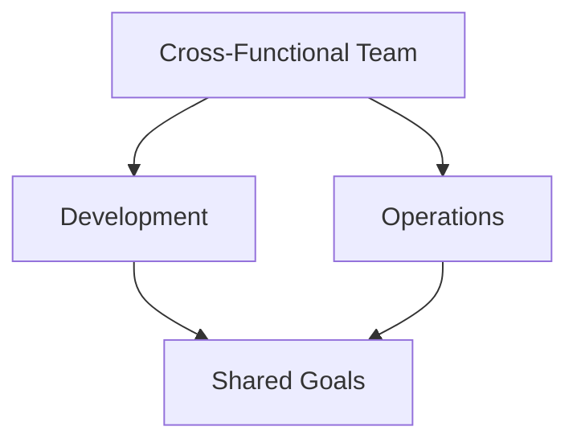
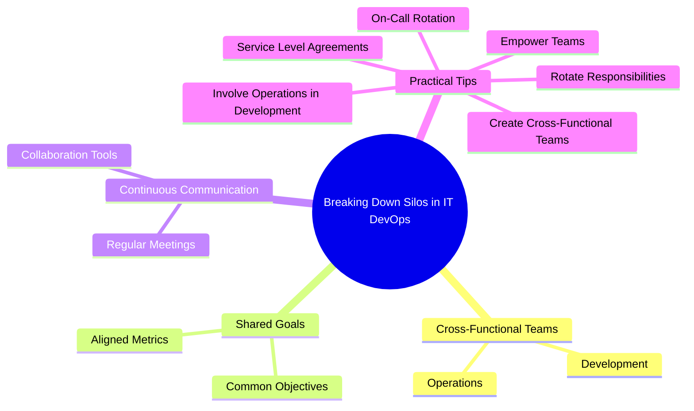

# README: Everyone is Responsible for Success

Everyone is responsible for success in a DevOps environment. It emphasizes the importance of consequences, collaboration, and shared responsibility to achieve high-quality software delivery

## Key Concepts

### Importance of Consequences
Jez Humble, the author of "Continuous Delivery," highlights that bad behavior arises when people are abstracted away from the consequences of their actions. Functional silos can lead to apathy and poor quality, as individuals do not see or feel the effects of their actions on other teams.

### Functional Silos Lead to Apathy
When teams are isolated in silos, they may not take responsibility for the overall quality of the software. For example, developers might focus solely on getting their features into "test" quickly, assuming that quality is the QA team's responsibility. This can lead to a decrease in software quality.

### Shared Responsibility
To avoid the pitfalls of functional silos, it is crucial to foster a culture of shared responsibility. This can be achieved by creating cross-functional teams, rotating developers through operations, and involving operations engineers in development activities

## Practical Tips

### Breaking Down Silos
1. **Create Cross-Functional Teams**: Ensure that teams include members from both development and operations
2. **Rotate Responsibilities**: Have developers rotate through operations to build empathy and understanding
3. **Involve Operations in Development**: Include operations engineers in developer standups and showcases

### Fostering Shared Responsibility
1. **On-Call Rotation**: Put developers on Pager Duty to make them feel the pain of operations and encourage better code quality
2. **Service Level Agreements**: Make developers own the service level agreements for the products and services they build
3. **Empower Teams**: Give teams local control over how to accomplish their goals while ensuring they understand the big picture

## Diagrams

### Misconceptions vs. Correct Approach

#### Misconceptions

#### Correct Approach

### Breaking Down Silos in IT DevOps

## In short
Everyone in the organization is responsible for the success of the software delivery process. By breaking down silos, fostering cross-functional teams, and sharing responsibilities, organizations can achieve continuous delivery of high-quality software

## References

- Werner Vogels: "You build it, you run it!"
- Jez Humble: "Bad behavior arises when you abstract people away from the consequences of their actions"