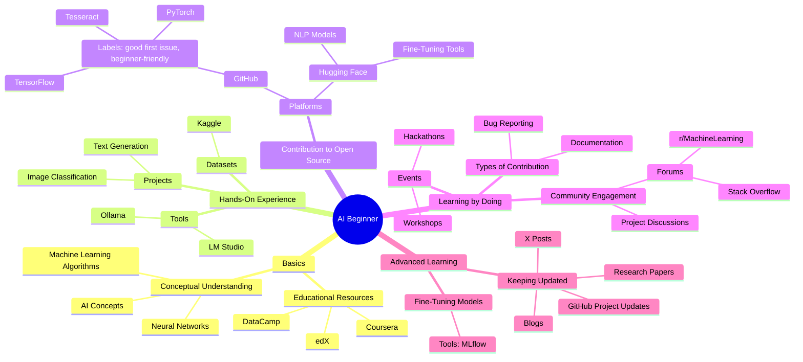

```mermaid
mindmap
  root((AI Beginner))
    Basics
      Educational Resources
        Coursera
        edX
        DataCamp
      Conceptual Understanding
        AI Concepts
        Machine Learning Algorithms
        Neural Networks
    Hands-On Experience
      Tools
        Ollama
        LM Studio
      Projects
        Image Classification
        Text Generation
      Datasets
        Kaggle
    Contribution to Open Source
      Platforms
        GitHub
          Labels: good first issue, beginner-friendly
            TensorFlow
            PyTorch
            Tesseract
        Hugging Face
          NLP Models
          Fine-Tuning Tools
    Learning by Doing
      Types of Contribution
        Documentation
        Bug Reporting
      Community Engagement
        Forums
          r/MachineLearning
          Stack Overflow
        Project Discussions
      Events
        Workshops
        Hackathons
    Advanced Learning
      Fine-Tuning Models
        Tools: MLflow
      Keeping Updated
        Blogs
        X Posts
        Research Papers
        GitHub Project Updates
```