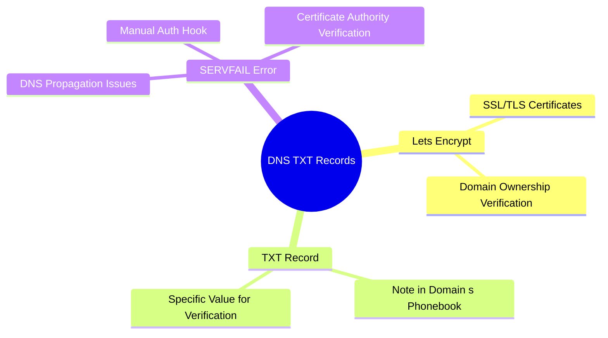

# Understanding Let’s Encrypt DNS SERVFAIL Error
Imagine you’re trying to get a certificate for your website using Let’s Encrypt, but you run into an error that looks like this:

```
Detail: DNS problem: SERVFAIL looking up TXT for _acme-challenge.my.domain.com - the domain's nameservers may be malfunctioning

Hint: The Certificate Authority failed to verify the DNS TXT records created by the --manual-auth-hook. Ensure that this hook is functioning correctly and that it waits a sufficient duration of time for DNS propagation. Refer to "certbot --help manual" and the Certbot User Guide.

```

How should we approach this problem? Let's break it down

## What's Let's encrypt?

Let’s Encrypt is a service that provides free SSL/TLS certificates, which are used to secure websites. 

When you use Let’s Encrypt, you need to prove that you own the domain you’re requesting a certificate for. One way to do this is by creating a special DNS record called a TXT record.
More information, visit [let's encrypt](https://letsencrypt.org/)

## What is a DNS TXT Record?
A DNS TXT record is like a note you leave in your domain’s phonebook (DNS). This note is used by Let’s Encrypt to verify that you control the domain. When you request a certificate, Let’s Encrypt asks you to create a TXT record with a specific value.



## What is the SERVFAIL Error?
The error message “SERVFAIL looking up TXT for _acme-challenge.my.domain.com” means that Let’s Encrypt tried to look up the TXT record you created, but it couldn’t find it. This could be because:

1. DNS Propagation Delay: When you create or update DNS (TXT) records, it can take **some time** for these changes to spread across the internet. This is called DNS propagation. If Let’s Encrypt checks too soon, it might not see the new record yet


1. DNS Configuration Issues: There might be a problem with your domain’s DNS configuration. This could be due to incorrect settings or issues with your DNS provider.

1. Manual Hook Script Issues: If you’re using a script to create the TXT record (a manual-auth-hook), the script might not be working correctly or might not be waiting long enough for DNS propagation.


## How to resolve the issue?


1. Check DNS Configuration:
   
    Use tools like dig or online services like DNS Checker to verify that the TXT record is correctly set up and visible.


1. Increase DNS Propagation Time:
    Make sure your script waits long enough for DNS changes to propagate. You can add a delay (e.g., sleep 120 for 2 minutes) in [your script](#sample-script-adjustment-for-propagation-time)

2. Review Manual Hook Script:
    Ensure your script is correctly creating the TXT record and [includes a sufficient delay for DNS propagation](#sample-script-adjustment-for-propagation-time).

3. Check for DNSSEC Issues:
    If your domain uses DNSSEC, ensure that the DNSSEC configuration is correct. Misconfigurations can lead to SERVFAIL errors.
Review Certbot Logs:
Check the Certbot logs (/var/log/letsencrypt/letsencrypt.log) for more detailed error messages that might provide additional clues.
Example Script Adjustment


## Sample script adjustment for propagation time

### Create TXT records in manual hook for Let's encrypt

Befor adjustment
```bash
#!/bin/bash
fn_create_txt_record(){
    az login --use-device-code
    az account set --subscription "$SUBSCRIPTION_ID"
    # create TXT recrod
    az network dns record-set txt add-record \
        --resource-group "your-resource-group" \
        --zone-name "your-domain.com" \
        --record-set-name "_acme-challenge" \
        --value "your-txt-value" \
        --ttl 60
    az network dns record-set txt add-record \
        --resource-group "myResourceGroup" \
        --zone-name "example.com" \
        --record-set-name "_acme-challenge" \
        --value "your-txt-value-from-certbot" \
        --ttl 60
}


fn_create_txt_record

```
After adjustment


After the adjustment, we add sleep to mkare  

```bash
#!/bin/bash
# Create TXT record
fn_create_txt_record
sleep 280  # Wait for 4 minutes to allow DNS propagation

```